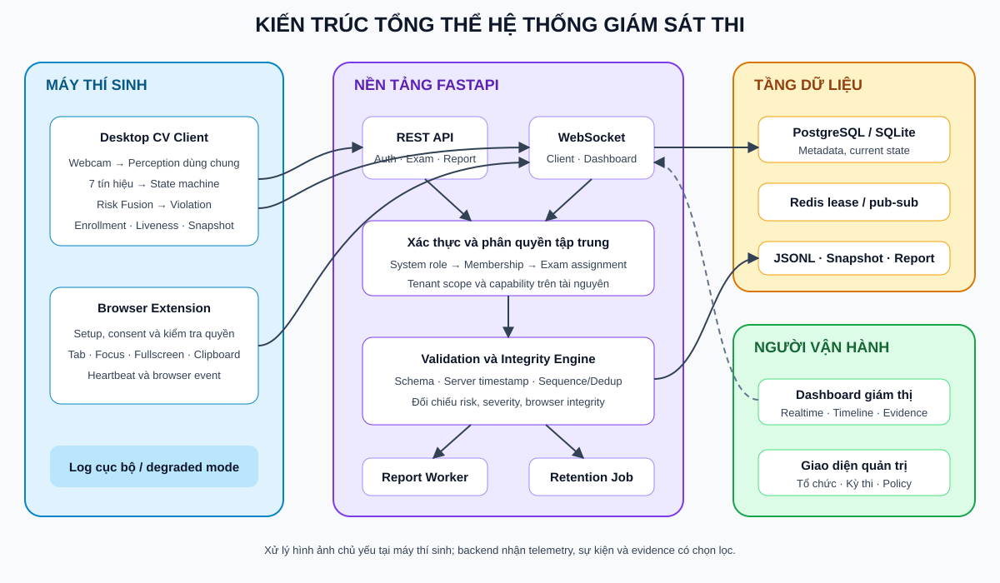
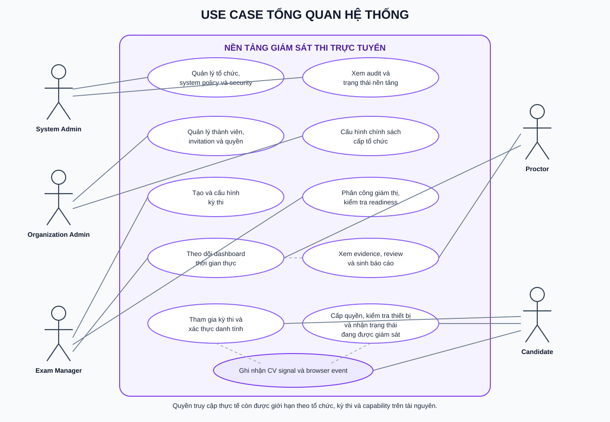
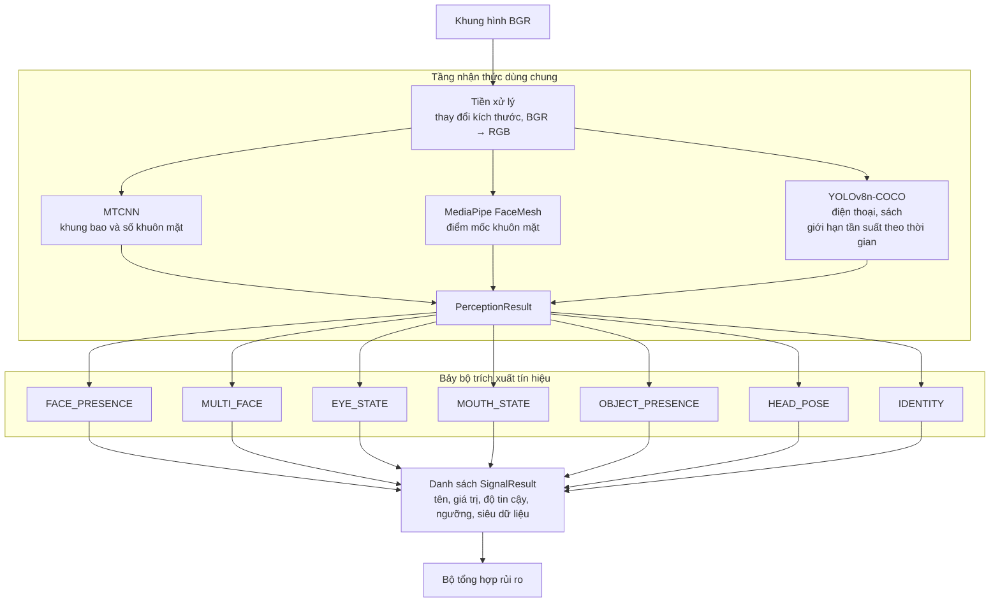
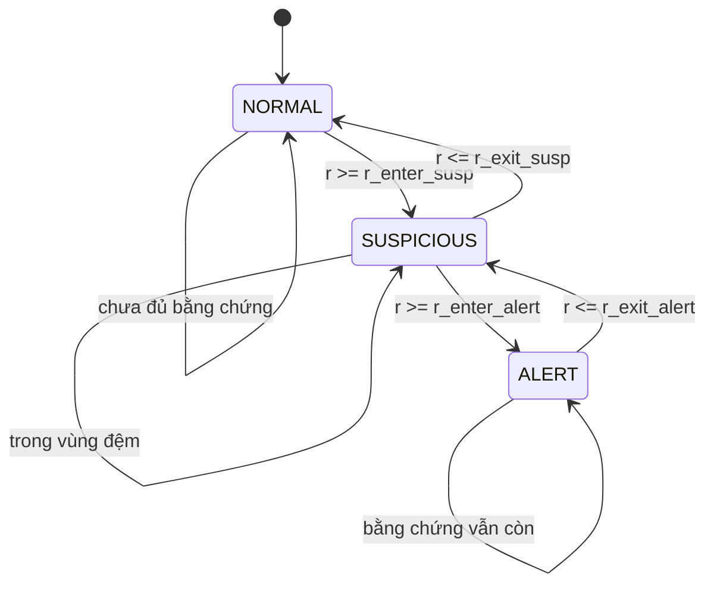
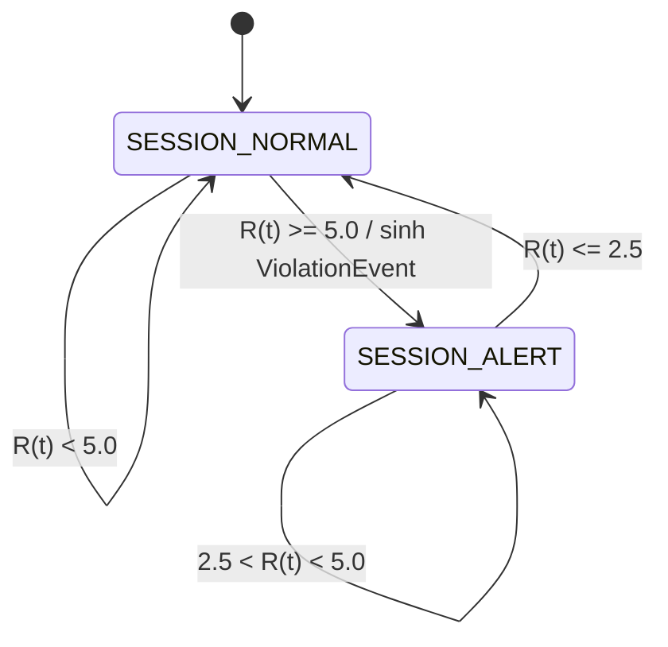
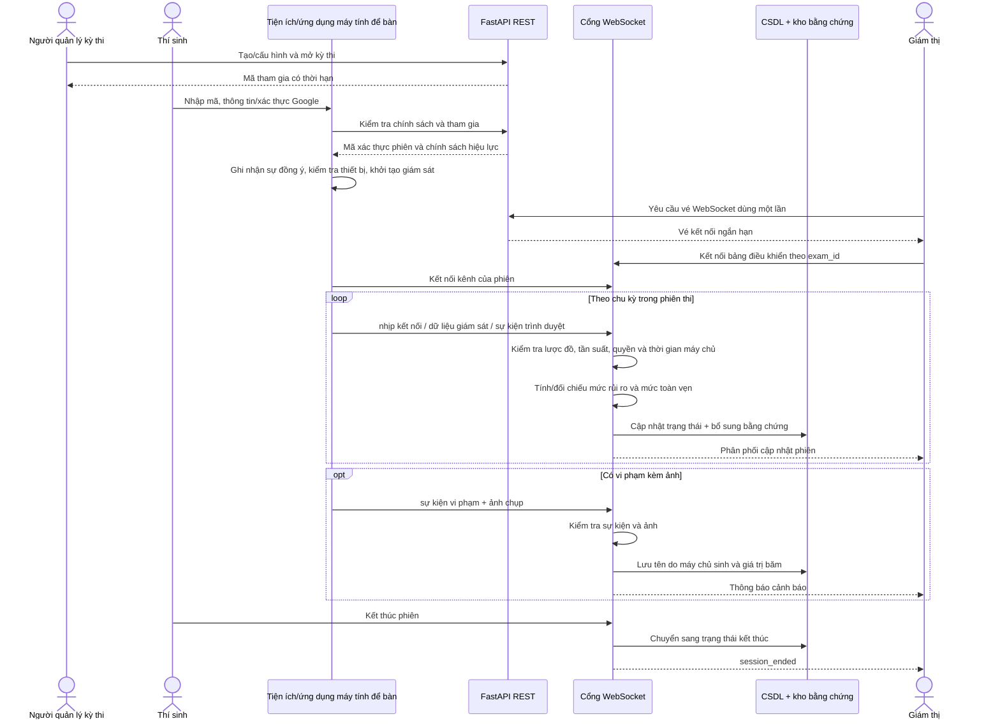
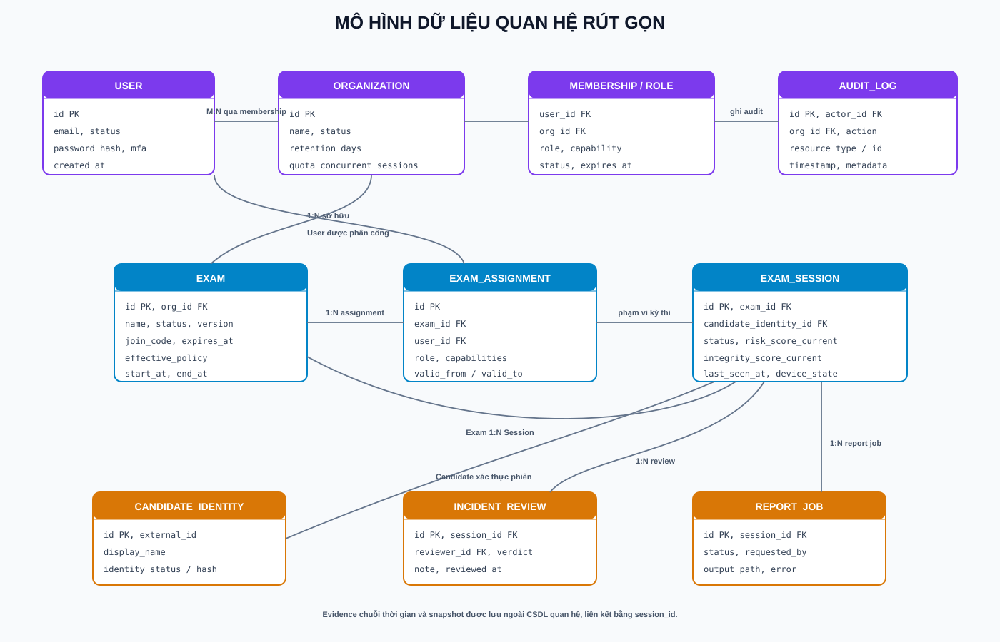
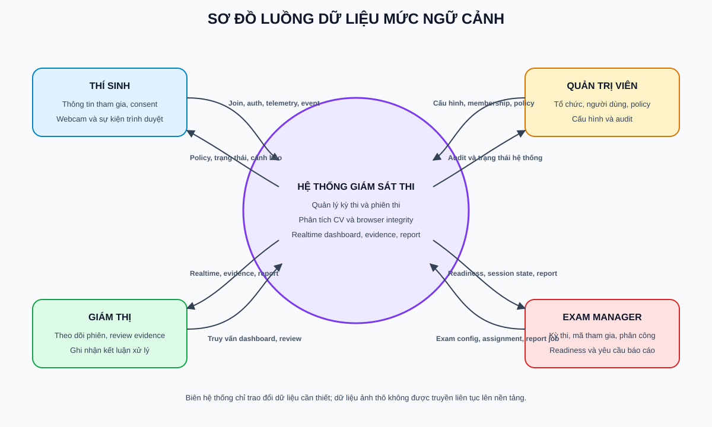
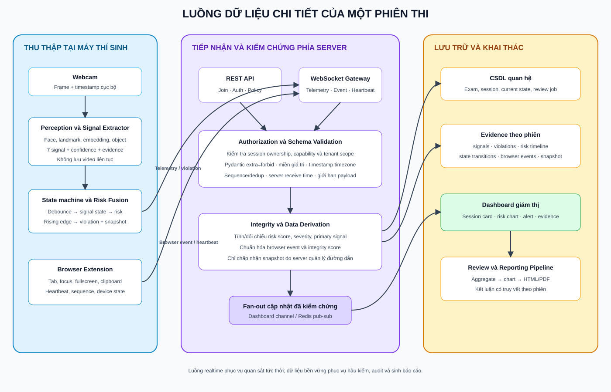
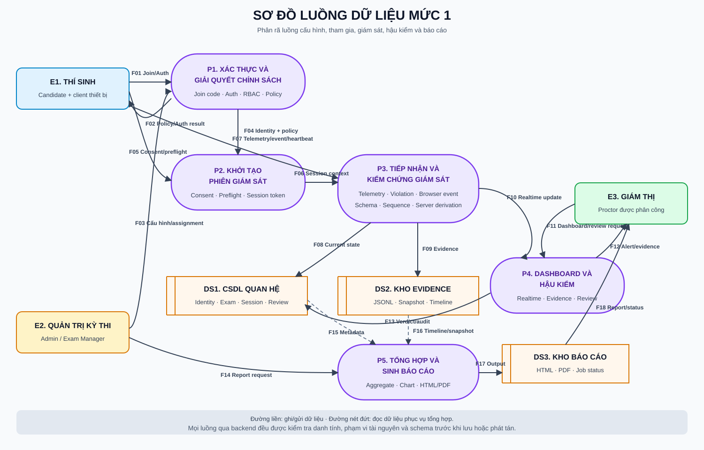

# Chương 4. Thiết kế giải pháp và các đóng góp

## Mở đầu chương

Các chương trước đã trình bày cơ sở lý thuyết của MTCNN, MediaPipe Face Landmarker, YOLOv8, FaceNet, bài toán ước lượng góc quay đầu và nguyên lý kết hợp đa tín hiệu; đồng thời xác định các yêu cầu `FR-*` và `NFR-*` của hệ thống. Vì vậy, chương này không lặp lại cách hoạt động của từng mô hình, mà tập trung vào các vấn đề kỹ thuật đã xuất hiện khi xây dựng một hệ thống giám sát thi hoàn chỉnh và những giải pháp đã được thiết kế, cài đặt để giải quyết các vấn đề đó.

Đóng góp của đồ án không nằm ở việc huấn luyện một mô hình thị giác máy tính mới, mà ở cách tổ chức các mô hình có sẵn thành chuỗi xử lý có trạng thái; kết hợp kết quả thị giác máy tính với dữ liệu toàn vẹn trình duyệt; và xây dựng lớp nền tảng nhiều tổ chức để truyền trạng thái, quản lý bằng chứng và tạo báo cáo có thể truy vết. Mỗi giải pháp trong chương được trình bày theo ba nội dung: bài toán đặt ra, giải pháp thực hiện và kết quả đã được kiểm chứng. Quan hệ giữa giải pháp và yêu cầu được tóm tắt tại mục 4.8.

## 4.1. Giải pháp kiến trúc tổng thể cho hệ thống giám sát thi

### 4.1.1. Bài toán và yêu cầu kiến trúc

Một chương trình chỉ đọc webcam và hiển thị nhãn bất thường chưa đủ để vận hành một kỳ thi. Hệ thống thực tế phải đồng thời giải quyết nhiều nhóm yêu cầu: xử lý hình ảnh tại máy thí sinh; giám sát các thao tác trong trình duyệt; xác thực và phân quyền người dùng; quản lý tổ chức, kỳ thi và phiên thi; chuyển trạng thái đến giám thị theo thời gian thực; lưu bằng chứng; và tổng hợp báo cáo sau kỳ thi.

Nhóm vấn đề này tương ứng với các yêu cầu `FR-SESSION-*`, `FR-RT-*`, `FR-EVID-*`, `FR-REPORT-*`, `NFR-PRIV-*` và `NFR-PORT-01` tại Chương 3.

Nếu ghép toàn bộ trách nhiệm vào một chương trình đơn khối, ba vấn đề sẽ xuất hiện. Thứ nhất, các mô hình thị giác máy tính có chi phí tính toán lớn và không phù hợp để chạy đồng bộ trong dịch vụ phía máy chủ phục vụ nhiều người dùng. Thứ hai, truyền video liên tục làm tăng băng thông, chi phí lưu trữ và phạm vi xử lý dữ liệu nhạy cảm. Thứ ba, giao diện quản trị, dữ liệu phiên và thuật toán nhận diện bị phụ thuộc chặt vào nhau, gây khó khăn cho kiểm thử và mở rộng.

### 4.1.2. Giải pháp

Đồ án tách hệ thống thành ba thành phần triển khai chính:

- **Ứng dụng máy tính để bàn bằng Python** thực hiện chuỗi xử lý thị giác máy tính trên webcam, đăng ký khuôn mặt, kiểm tra sự hiện diện sống cơ bản, tính bảy tín hiệu và tổng hợp điểm rủi ro ngay tại máy thí sinh.
- **Tiện ích mở rộng trình duyệt** quản lý luồng tham gia kỳ thi, kiểm tra chính sách thiết bị và ghi nhận các sự kiện như rời chế độ toàn màn hình, chuyển thẻ, mất trạng thái tập trung, thao tác với bảng tạm, hoặc dừng camera/chia sẻ màn hình.
- **Dịch vụ FastAPI và bảng điều khiển** quản lý tổ chức, tài khoản, kỳ thi, phiên thi, phân quyền, kết nối WebSocket, lưu bằng chứng, hỗ trợ giám thị hậu kiểm sự cố và tạo báo cáo.

Kiến trúc tổng thể được minh họa ở Hình 4.1. Sơ đồ phân biệt bốn vùng trách nhiệm: thu thập và xử lý tại máy thí sinh; tiếp nhận, kiểm chứng và điều phối tại nền tảng; lưu trữ dữ liệu; và khai thác dữ liệu qua các giao diện vận hành. Các đường kết nối cũng cho thấy REST được dùng cho nghiệp vụ có trạng thái, còn WebSocket phục vụ dữ liệu giám sát, nhịp kết nối và cập nhật bảng điều khiển theo thời gian thực.



**Hình 4.1. Kiến trúc tổng thể của hệ thống**

Quyết định quan trọng của kiến trúc là không truyền luồng video liên tục đến máy chủ. Ứng dụng phía thí sinh chỉ gửi dữ liệu giám sát đã gom theo chu kỳ, mặc định một giây, cùng ảnh chụp tại thời điểm có sự kiện cần làm bằng chứng. Máy chủ không chạy mô hình thị giác máy tính nhưng cũng không tin hoàn toàn dữ liệu từ máy khách: thông điệp phải đúng lược đồ và chứa đủ bảy tín hiệu; điểm rủi ro, trạng thái, mức nghiêm trọng và tín hiệu đóng góp được tính lại hoặc đối chiếu trước khi lưu và chuyển tiếp.

### 4.1.3. Kết quả đạt được

Kiến trúc trên tạo ranh giới rõ ràng giữa xử lý nhận diện, giám sát trình duyệt, vận hành nền tảng và lưu trữ. Chuỗi xử lý thị giác máy tính vẫn có thể chạy cục bộ khi máy chủ không khả dụng; dịch vụ phía máy chủ và bảng điều khiển không phụ thuộc vào thư viện học sâu; giao diện giám thị chỉ nhận dữ liệu cần thiết thay vì video liên tục. Cách phân tách này giúp giảm băng thông và thu hẹp phạm vi dữ liệu hình ảnh truyền qua mạng.

Hệ thống hiện có hai nhánh phía máy khách: ứng dụng thị giác máy tính trên máy tính để bàn và tiện ích mở rộng trình duyệt. Tuy nhiên, hai nhánh chưa được hợp nhất hoàn toàn vào cùng một phiên bằng cầu nối nhắn tin với ứng dụng cục bộ (native messaging). Kiến trúc đã có các hợp đồng dữ liệu chung, nhưng việc phối hợp đồng thời ứng dụng thị giác máy tính và tiện ích mở rộng trong một phiên vẫn là hướng phát triển tiếp theo.

## 4.2. Giải pháp mô hình hóa tác nhân, ca sử dụng và phân quyền

### 4.2.1. Bài toán quản lý nhiều phạm vi người dùng

Trong một hệ thống giám sát thi, “quản trị viên” không phải là một vai trò duy nhất. Người quản trị nền tảng cần quản lý tổ chức nhưng không nên mặc nhiên xem dữ liệu nhạy cảm của thí sinh. Quản trị viên tổ chức cần quản lý thành viên và chính sách nhưng không nhất thiết vận hành kỳ thi. Người tạo kỳ thi, người quản lý kỳ thi và giám thị lại có quyền khác nhau trên từng kỳ thi cụ thể. Ngoài ra, thí sinh chỉ được truy cập đúng phiên của mình, không dùng chung cơ chế xác thực với nhân sự quản trị.

Nếu chỉ kiểm tra một trường vai trò (`role`) toàn cục, một người là quản lý ở kỳ thi A có thể bị hiển thị nhầm quyền quản lý ở kỳ thi B, hoặc người thuộc tổ chức này có thể suy đoán sự tồn tại của tài nguyên thuộc tổ chức khác.

Giải pháp tại mục này đáp ứng các nhóm `FR-AUTH-*`, `FR-ORG-*`, `FR-EXAM-04`, `FR-EXAM-05` và `NFR-SEC-01`.

### 4.2.2. Giải pháp

Đồ án xây dựng kiểm soát truy cập theo ba bước: xác thực danh tính, xác định phạm vi và kiểm tra năng lực trên tài nguyên. Các vai trò và ca sử dụng chính được thể hiện ở Hình 4.2. Ranh giới ca sử dụng mô tả chức năng người dùng nhìn thấy; quyền thực thi cuối cùng vẫn do máy chủ quyết định theo tổ chức, kỳ thi và tài nguyên cụ thể.



**Hình 4.2. Các ca sử dụng theo vai trò của hệ thống**

#### 4.2.2.1. Danh mục tác nhân và ca sử dụng

Để tránh hiểu sơ đồ như một danh sách quyền toàn cục, các ca sử dụng được định danh và gắn với phạm vi tài nguyên cụ thể. Một người có thể đồng thời mang nhiều vai trò, nhưng mỗi thao tác chỉ hợp lệ khi vai trò đó còn hiệu lực trong đúng phạm vi tổ chức hoặc kỳ thi.

| Mã | Ca sử dụng | Tác nhân chính | Phạm vi | Kết quả đầu ra |
|---|---|---|---|---|
| `UC-01` | Quản trị nền tảng | Quản trị viên hệ thống | Toàn hệ thống | Tổ chức, hạn mức, chính sách hệ thống và nhật ký kiểm toán được cập nhật |
| `UC-02` | Quản trị tổ chức | Quản trị viên tổ chức | Một tổ chức | Thành viên, lời mời, chính sách và quyền truy cập ngoại lệ được quản lý |
| `UC-03` | Tạo và cấu hình kỳ thi | Người quản lý/chủ sở hữu kỳ thi | Một kỳ thi | Kỳ thi, mã tham gia, thời gian, chính sách và phân công hợp lệ |
| `UC-04` | Kiểm tra điều kiện sẵn sàng và mở kỳ thi | Người quản lý/chủ sở hữu kỳ thi | Một kỳ thi | Danh sách điều kiện đạt/chưa đạt; trạng thái kỳ thi được chuyển hợp lệ |
| `UC-05` | Tham gia và xác thực thí sinh | Thí sinh | Một kỳ thi/phiên | Danh tính thí sinh, mã xác thực phiên và chính sách hiệu lực |
| `UC-06` | Khởi tạo giám sát thiết bị | Thí sinh | Phiên của chính mình | Sự đồng ý, kết quả kiểm tra trước phiên, đăng ký/xác minh sự hiện diện sống và kết nối máy khách |
| `UC-07` | Theo dõi phiên theo thời gian thực | Giám thị, người quản lý kỳ thi | Kỳ thi được phân công | Chỉ số tổng hợp, trạng thái phiên, mức rủi ro, mức toàn vẹn và cảnh báo mới nhất |
| `UC-08` | Xem bằng chứng và hậu kiểm sự cố | Giám thị có quyền tương ứng | Phiên được phân công | Kết luận và ghi chú hậu kiểm, không sửa sự kiện gốc |
| `UC-09` | Kết thúc phiên | Thí sinh hoặc nhân sự có quyền | Một phiên | Trạng thái kết thúc và lý do được ghi nhận |
| `UC-10` | Sinh và tải báo cáo | Người quản lý kỳ thi/giám thị có quyền tương ứng | Một phiên/kỳ thi | Tác vụ báo cáo và tệp HTML/PDF có thể truy vết |

Quan hệ tác nhân–ca sử dụng không thay thế việc kiểm tra quyền chức năng. Ví dụ, `UC-08` chỉ khả dụng nếu giám thị có quyền `exam.evidence.read` trên đúng kỳ thi; quản trị viên hệ thống muốn đọc bằng chứng phải có quyền truy cập ngoại lệ còn hiệu lực thay vì chỉ dựa vào vai trò hệ thống.

#### 4.2.2.2. Đặc tả các ca sử dụng cốt lõi

**UC-03 – Tạo và cấu hình kỳ thi**

| Thuộc tính | Nội dung |
|---|---|
| Tác nhân | Chủ sở hữu hoặc người quản lý kỳ thi có `exam.manage` |
| Tiền điều kiện | Người dùng đã đăng nhập; tổ chức và tư cách thành viên đang hoạt động; hạn mức cho phép |
| Luồng chính | Mở không gian làm việc của kỳ thi → nhập siêu dữ liệu và thời gian → chọn phương thức xác thực → cấu hình chính sách → phân công nhân sự → lưu phiên bản cấu hình |
| Luồng thay thế/ngoại lệ | Dữ liệu sai miền bị từ chối; chính sách yếu hơn mức sàn của hệ thống/tổ chức không được lưu; xung đột phiên bản trả về lỗi kiểm soát đồng thời lạc quan |
| Hậu điều kiện | Kỳ thi ở trạng thái cấu hình, có chính sách hiệu lực và danh sách phân công có phạm vi rõ ràng |

**UC-05/UC-06 – Tham gia và khởi tạo giám sát**

| Thuộc tính | Nội dung |
|---|---|
| Tác nhân | Thí sinh |
| Tiền điều kiện | Mã tham gia còn hạn; kỳ thi cho phép tham gia; thiết bị có trình duyệt hoặc ứng dụng máy tính để bàn phù hợp |
| Luồng chính | Nhập mã tham gia → nhận thông tin và chính sách → xác thực thủ công hoặc qua Google → xác nhận sự đồng ý → chạy kiểm tra trước phiên → tạo phiên và nhận mã xác thực phiên → thực hiện đăng ký/xác minh sự hiện diện sống nếu dùng ứng dụng thị giác máy tính → mở kênh WebSocket |
| Luồng thay thế/ngoại lệ | Mã sai/hết hạn, kỳ thi chưa mở, chưa có sự đồng ý, quyền camera/chia sẻ màn hình bị từ chối hoặc xác minh sự hiện diện sống thất bại thì phiên không chuyển sang giám sát đầy đủ |
| Hậu điều kiện | Phiên thuộc đúng thí sinh và kỳ thi; máy khách chỉ gửi dữ liệu bằng mã xác thực của phiên đó; trạng thái thiết bị được quan sát trên bảng điều khiển |

**UC-07 – Theo dõi phiên thời gian thực**

| Thuộc tính | Nội dung |
|---|---|
| Tác nhân | Giám thị hoặc người quản lý kỳ thi được phân công |
| Tiền điều kiện | Người dùng đã đăng nhập và có `exam.monitor`; kỳ thi tồn tại trong phạm vi tổ chức hiện hành |
| Luồng chính | Mở bảng điều khiển → tải trạng thái hiện tại qua REST → lấy vé kết nối WebSocket dùng một lần → nhận dữ liệu giám sát/sự kiện trình duyệt đã kiểm chứng → lọc và mở chi tiết phiên |
| Luồng thay thế/ngoại lệ | Vé kết nối hết hạn hoặc đã dùng bị từ chối; khi kênh WebSocket mất kết nối, giao diện phải báo dữ liệu có thể cũ và thực hiện kết nối lại |
| Hậu điều kiện | Người giám thị quan sát được mức rủi ro, mức toàn vẹn, kết nối và cảnh báo mà không truy cập phiên ngoài phạm vi phân công |

**UC-08 – Hậu kiểm bằng chứng**

| Thuộc tính | Nội dung |
|---|---|
| Tác nhân | Giám thị có quyền đọc và hậu kiểm bằng chứng |
| Tiền điều kiện | Phiên thuộc kỳ thi được phân công; ảnh chụp và nhật ký đã qua kiểm tra đường dẫn/phạm vi |
| Luồng chính | Mở chi tiết phiên → chọn sự kiện trên dòng thời gian → xem các tín hiệu đóng góp, sự kiện trình duyệt và ảnh chụp → nhập kết luận/ghi chú → xác nhận hậu kiểm |
| Luồng thay thế/ngoại lệ | Nếu thiếu bằng chứng, hệ thống vẫn hiển thị siêu dữ liệu còn lại; truy cập chéo tổ chức hoặc đường dẫn ngoài thư mục phiên bị từ chối |
| Hậu điều kiện | Bản ghi `IncidentReview` mới được tạo và ghi vào nhật ký kiểm toán; `ViolationEvent` nguyên bản không bị thay đổi |

**UC-10 – Sinh báo cáo**

| Thuộc tính | Nội dung |
|---|---|
| Tác nhân | Người quản lý kỳ thi hoặc giám thị có `exam.reports.export` |
| Tiền điều kiện | Phiên tồn tại; người dùng có quyền trên kỳ thi; dữ liệu phiên đã được tổng hợp sẵn |
| Luồng chính | Yêu cầu báo cáo → tạo tác vụ ở trạng thái `pending` → tiến trình nền đọc dữ liệu SQL và bằng chứng → tổng hợp/lập biểu đồ → xuất HTML/PDF → tác vụ chuyển sang `completed` |
| Luồng thay thế/ngoại lệ | Tệp bằng chứng bị thiếu được đọc theo chế độ dung nạp lỗi; lỗi dựng báo cáo chuyển tác vụ sang `failed` và được ghi lại, không công bố đầu ra chưa hoàn chỉnh |
| Hậu điều kiện | Báo cáo được gắn đúng phiên, có đường dẫn do máy chủ quản lý và chỉ được tải sau khi kiểm tra quyền |

Ở tầng dữ liệu, quyền được biểu diễn bởi ba loại quan hệ:

- `SystemRole` gán vai trò `system_admin` ngoài phạm vi một tổ chức.
- `OrganizationMembership` gán `org_admin` hoặc `exam_manager` trong một tổ chức đang hoạt động.
- `ExamAssignment` gán `owner`, `manager` hoặc `proctor` trên từng kỳ thi.

Phía máy chủ không phân quyền bằng các câu lệnh điều kiện rải rác trong từng API. Các quyền chức năng như `exam.manage`, `exam.monitor`, `exam.evidence.read` và `exam.reports.export` được giải quyết tập trung. Khi truy cập một kỳ thi hoặc phiên, hệ thống kiểm tra đồng thời trạng thái tài khoản, tổ chức hiện hành, tư cách thành viên, phân công, thời hạn và loại hành động. Tài nguyên ngoài phạm vi tổ chức hoặc kỳ thi chưa được phân công thường trả về `404` để hạn chế tiết lộ sự tồn tại; trường hợp đã đúng phạm vi nhưng thiếu quyền trả về `403`.

Quản trị viên hệ thống phải bật xác thực đa yếu tố (MFA) thì vai trò hệ thống mới có hiệu lực. Vai trò này không có quyền truy cập mặc định vào bằng chứng của thí sinh. Khi cần hỗ trợ sự cố, người quản trị phải có `AccessGrant` chỉ đọc, thuộc đúng tổ chức, còn thời hạn và chưa bị thu hồi. Thao tác nhạy cảm được liên kết với `AuditLog` để lưu chủ thể, phạm vi, hành động, kết quả, lý do, mã yêu cầu và trạng thái trước/sau.

Thí sinh được tách khỏi bảng tài khoản nhân sự. Chế độ thủ công tạo phiên từ mã dự thi và thông tin thí sinh; chế độ Google chỉ lưu các thuộc tính OIDC tối thiểu trong `CandidateIdentity`, không lưu mã truy cập hoặc mã làm mới của Google. Mã xác thực phiên thí sinh và mã xác thực người dùng có loại riêng, không thể dùng thay thế cho nhau.

Các ca sử dụng được triển khai theo nguyên tắc “quyền tối thiểu”: quản trị viên hệ thống quản lý toàn bộ nền tảng nhưng không mặc nhiên đọc bằng chứng; quản trị viên tổ chức quản lý phạm vi tổ chức; người quản lý kỳ thi chịu trách nhiệm cấu hình và vòng đời kỳ thi; giám thị tập trung vào giám sát, hậu kiểm và báo cáo; thí sinh chỉ tham gia và gửi dữ liệu của phiên đã xác thực. Việc tách nhiệm vụ này giảm khả năng một vai trò vừa tạo chính sách, vừa vận hành, vừa tự xác nhận kết quả mà không có dấu vết trong nhật ký kiểm toán.

### 4.2.3. Kết quả đạt được

Giải pháp đã tạo được mô hình quản trị đa tổ chức và giới hạn quyền theo từng tài nguyên. Một người quản lý kỳ thi chỉ liệt kê được các kỳ thi mình được phân công; vai trò quản lý ở kỳ thi này không làm phát sinh quyền quản lý ở kỳ thi khác. Quản trị viên tổ chức được tách khỏi công việc vận hành kỳ thi, còn quản trị viên hệ thống chỉ đọc dữ liệu giám sát khi có quyền ngoại lệ hợp lệ.

Các trường hợp cô lập tổ chức, thu hồi vai trò/phân công, nhầm loại mã xác thực, quyền WebSocket và quyền trên từng kỳ thi đã được đưa vào kiểm thử hồi quy. Nhờ đó, phân quyền không chỉ tồn tại ở giao diện mà được thực thi tại máy chủ đối với REST, WebSocket và thao tác tải tệp.

## 4.3. Giải pháp chuỗi xử lý nhận thức và trích xuất tín hiệu dùng chung

### 4.3.1. Bài toán xử lý nhiều mô hình trên mỗi khung hình

Bảy tín hiệu giám sát không hoàn toàn độc lập về dữ liệu đầu vào. Tín hiệu hiện diện khuôn mặt, nhiều khuôn mặt và danh tính cần vùng khuôn mặt; trạng thái mắt, trạng thái miệng và tư thế đầu cần các điểm mốc; còn tín hiệu hiện diện vật thể cần kết quả phát hiện vật thể. Nếu mỗi tín hiệu tự tải mô hình và tự xử lý lại khung hình, cùng một phép phát hiện sẽ chạy nhiều lần, làm giảm tốc độ và khiến các tín hiệu sử dụng kết quả không đồng nhất về thời điểm.

Đây là bài toán trung tâm của `FR-CV-01`, `NFR-PERF-01`, `NFR-REL-01` và `NFR-MAIN-02`.

Ngoài ra, YOLOv8 có chi phí tính toán lớn hơn các bước xử lý còn lại. Chạy YOLO ở mọi khung hình gây lãng phí tài nguyên, nhưng nếu bỏ trống kết quả ở các khung hình không chạy mô hình thì bộ đếm thời gian xuất hiện vật thể sẽ bị ngắt sai.

### 4.3.2. Giải pháp

Chuỗi xử lý được tổ chức thành ba tầng nội bộ, minh họa ở Hình 4.3.



**Hình 4.3. Kiến trúc chuỗi xử lý thị giác máy tính**

Tầng nhận thức chỉ chạy mỗi bộ phát hiện một lần rồi đóng gói dữ liệu vào `PerceptionResult`. Mọi bộ trích xuất tín hiệu đều tuân theo cùng hợp đồng `process(PerceptionResult) -> SignalResult`. Nhờ hợp đồng này, thuật toán từng tín hiệu có thể phát triển và kiểm thử độc lập với camera và mô hình thật.

YOLO được giới hạn tần suất theo thời gian với chu kỳ mặc định 0,4 giây. Trong khoảng giữa hai lần suy luận, chuỗi xử lý giữ lại kết quả vật thể gần nhất thay vì trả danh sách rỗng. Bộ trích xuất tín hiệu vật thể sau đó yêu cầu vật thể xuất hiện liên tục tối thiểu một giây. Hai cơ chế phối hợp giúp giảm chi phí suy luận mà vẫn duy trì ngữ nghĩa thời gian.

Mỗi lời gọi bộ phát hiện được bọc bằng cơ chế dự phòng. Nếu một bộ phát hiện gặp lỗi tạm thời trên một khung hình, chuỗi xử lý trả kết quả rỗng hoặc dùng kết quả vật thể gần nhất thay vì làm kết thúc toàn bộ phiên thi. Thời gian xử lý của từng bước cũng được ghi lại để xác định nút thắt hiệu năng.

Bảng 4.1 tóm tắt vai trò triển khai của bảy tín hiệu. Công thức chi tiết của EAR, tỉ lệ mở miệng, PnP và cosine similarity đã được trình bày ở Chương 2 nên không lặp lại tại đây.

| Tín hiệu | Dữ liệu dùng chung | Cách ổn định chính | Tham số cấu hình hiện tại |
|---|---|---|---|
| `FACE_PRESENCE` | Khung bao khuôn mặt | Chỉ bất thường khi vắng mặt đủ lâu | 2,0 giây |
| `MULTI_FACE` | Khung bao khuôn mặt | Lọc khuôn mặt có độ tin cậy thấp | độ tin cậy ≥ 0,90 |
| `EYE_STATE` | Điểm mốc khuôn mặt | Kết hợp hai mắt và thời lượng nhắm | EAR 0,21; 1,0 giây |
| `MOUTH_STATE` | Điểm mốc khuôn mặt | Tỉ lệ chuẩn hóa và cửa sổ hoạt động theo thời gian | cửa sổ 2,0 giây; tỉ lệ hoạt động 0,25 |
| `OBJECT_PRESENCE` | Khung bao từ YOLO | Giới hạn tần suất mô hình và lọc nhiễu theo thời lượng | 1,0 giây; mô hình lọc điện thoại/sách |
| `HEAD_POSE` | Điểm mốc khuôn mặt | Ngưỡng góc ngang/dọc và thời lượng quay | 20°; 1,0 giây |
| `IDENTITY` | Vùng cắt khuôn mặt/vectơ đặc trưng | Hai mức tương đồng cosin, kiểm tra lại định kỳ và yêu cầu lỗi liên tiếp | 30 giây; ngưỡng cảnh báo sớm 0,55; ngưỡng cảnh báo 0,40 |

### 4.3.3. Kết quả đạt được

Chuỗi xử lý đã cài đặt đủ bảy lớp tín hiệu theo một giao diện chung. Có thể thay bộ phát hiện bằng đối tượng giả trong kiểm thử đơn vị, đồng thời vẫn có kiểm thử khởi động cơ bản với các mô hình thật và kiểm thử tích hợp trên video mẫu. Các trường hợp bộ phát hiện gặp lỗi, thiếu điểm mốc, khuôn mặt xuất hiện lại, vật thể chỉ xuất hiện thoáng qua và danh tính chưa được đăng ký đều được xử lý mà không làm chuỗi xử lý dừng đột ngột.

So với cách dùng bộ đếm số khung hình, nhiều điều kiện trong đồ án được quy đổi sang giây và cửa sổ thời gian. Vì vậy, ý nghĩa của ngưỡng ít phụ thuộc hơn vào tốc độ khung hình (FPS) của máy. Việc chuẩn hóa độ mở miệng theo kích thước khuôn mặt cũng giảm ảnh hưởng của khoảng cách giữa thí sinh và camera.

## 4.4. Giải pháp kết hợp đa tín hiệu theo thời gian

### 4.4.1. Bài toán báo động giả và dao động trạng thái

Kết quả của một khung hình đơn lẻ không đủ để kết luận hành vi bất thường. Người dùng có thể chớp mắt, nhìn sang bên trong thời gian ngắn hoặc một bộ phát hiện có thể nhận nhầm vật thể ở đúng một khung hình. Nếu ghi một vi phạm cho mọi khung hình vượt ngưỡng, nhật ký sẽ bị ngập bởi các sự kiện lặp và giám thị khó phân biệt hành vi kéo dài với nhiễu tức thời.

Giải pháp tại mục này trực tiếp hiện thực `FR-CV-03`, `FR-CV-04`, `NFR-MAIN-01` và `NFR-EXPL-01`.

Một ngưỡng duy nhất cũng làm trạng thái liên tục bật/tắt khi điểm số dao động gần biên. Ngoài ra, các hành vi không có mức nghiêm trọng như nhau: không khớp danh tính hoặc có điện thoại cần đóng góp nhiều hơn một lần nhắm mắt.

### 4.4.2. Giải pháp

Đồ án áp dụng hai cấp trạng thái. Cấp thứ nhất là một máy trạng thái độc lập cho từng tín hiệu. Trong cửa sổ trượt mặc định bốn giây, hệ thống tính:

$$
r_i(t)=\frac{N_{i,\text{vượt ngưỡng}}(t-W,t)}{N_{i,\text{hợp lệ}}(t-W,t)}
$$

với $W$ là độ dài cửa sổ và $r_i(t)$ là tỉ lệ quan sát bất thường của tín hiệu $i$. Máy trạng thái có ba trạng thái `NORMAL`, `SUSPICIOUS` và `ALERT`. Ngưỡng đi vào trạng thái cao hơn lớn hơn ngưỡng đi ra, tạo cơ chế ngưỡng trễ ngay bên trong từng tín hiệu.



**Hình 4.4. Máy trạng thái độc lập của một tín hiệu**

Ở cấp thứ hai, các trạng thái được ánh xạ thành `NORMAL = 0`, `SUSPICIOUS = 1`, `ALERT = 2`. Điểm rủi ro phiên được tính bằng:

$$
R(t)=\sum_{i=1}^{7} w_i s_i(t)
$$

trong đó $w_i$ là trọng số tín hiệu đọc từ tệp cấu hình và $s_i(t)$ là giá trị trạng thái. Cấu hình hiện tại sử dụng trọng số: danh tính 3,0; hiện diện vật thể 2,5; hiện diện khuôn mặt 2,0; nhiều khuôn mặt 2,0; trạng thái mắt 1,0; trạng thái miệng 1,0; tư thế đầu 1,0. Các giá trị này không được ghi cố định trong thuật toán mà được tập trung tại `config/fusion.yaml` để có thể hiệu chỉnh có kiểm soát.

Trạng thái phiên sử dụng hai ngưỡng: chuyển từ `SESSION_NORMAL` sang `SESSION_ALERT` khi $R(t) \geq 5,0$ và chỉ trở về bình thường khi $R(t) \leq 2,5$. Vùng giữa hai ngưỡng giữ nguyên trạng thái trước đó. Một `ViolationEvent` chỉ được sinh tại cạnh lên, tức thời điểm phiên vừa chuyển sang cảnh báo; hệ thống không tạo lại sự kiện ở mỗi khung hình trong khi cảnh báo còn kéo dài.



**Hình 4.5. Cơ chế ngưỡng trễ ở cấp phiên thi**

Khi tạo sự kiện, bộ tổng hợp lưu điểm rủi ro, mức nghiêm trọng, tín hiệu đóng góp, loại vi phạm chính và đường dẫn ảnh chụp. Vi phạm chính là tín hiệu có tích $w_i \times s_i$ lớn nhất tại thời điểm cạnh lên. Cách chọn này vẫn hoạt động khi cảnh báo được tạo bởi nhiều tín hiệu `SUSPICIOUS` cộng dồn mà chưa có tín hiệu riêng lẻ ở `ALERT`.

### 4.4.3. Kết quả đạt được

Giải pháp loại bỏ việc sinh cảnh báo lặp theo khung hình và cho phép nhiều tín hiệu tác động đồng thời đến một quyết định. Máy trạng thái của bảy tín hiệu được cập nhật độc lập nên một tín hiệu trở lại bình thường không xóa lịch sử của tín hiệu khác. Tất cả lần chuyển trạng thái, diễn biến điểm rủi ro và sự kiện vi phạm đều có thể được lưu để giải thích quyết định sau kỳ thi.

Các kiểm thử đã bao phủ các tình huống: chưa vượt ngưỡng không sinh sự kiện; cạnh lên sinh đúng một sự kiện; trạng thái cảnh báo kéo dài không tạo bản ghi trùng; phiên có thể trở lại bình thường và cảnh báo lại; nhiều tín hiệu cùng đóng góp; mức nghiêm trọng cao; ảnh chụp và lần chuyển trạng thái được ghi đúng. Tuy nhiên, trọng số và ngưỡng hiện tại là cấu hình khởi tạo đã được kiểm chứng về logic, chưa phải kết quả tối ưu hóa trên một bộ dữ liệu thực lớn có nhãn tham chiếu.

## 4.5. Giải pháp giám sát thời gian thực và kiểm chứng dữ liệu giám sát

### 4.5.1. Bài toán truyền trạng thái từ máy khách không đáng tin cậy hoàn toàn

Giám thị cần thấy thay đổi của nhiều phiên gần như tức thời. Việc thăm dò REST liên tục tạo độ trễ và tải thừa, trong khi WebSocket cho phép cập nhật hai chiều nhưng phát sinh rủi ro khác: mã xác thực có thể bị lộ trong URL, thông điệp có thể bị giả mạo hoặc gửi quá nhanh, dấu thời gian của máy khách có thể sai và kết nối có thể mất mà bảng điều khiển không nhận biết.

Các yêu cầu liên quan gồm `FR-RT-*`, `FR-SESSION-03`, `NFR-SEC-02`, `NFR-SEC-03` và `NFR-PERF-02`.

### 4.5.2. Giải pháp

Hệ thống sử dụng hai kênh WebSocket tách biệt: kênh máy khách của từng phiên và kênh bảng điều khiển theo kỳ thi. WebSocket trên trình duyệt không truyền JWT trong chuỗi truy vấn. Bảng điều khiển trước tiên gọi REST để nhận một vé kết nối dùng một lần, tồn tại trong thời gian ngắn, sau đó đưa vé qua giao thức con khi mở kết nối. Ứng dụng máy tính để bàn sử dụng mã xác thực phiên riêng.

Trình tự xử lý một phiên được mô tả trong Hình 4.6.



**Hình 4.6. Sơ đồ trình tự của một phiên thi được giám sát**

Mọi thông điệp được ánh xạ vào lược đồ chặt chẽ, đồng thời bị giới hạn kích thước và tần suất. Máy chủ dùng dấu thời gian tiếp nhận làm thời gian chuẩn; dấu thời gian của máy khách chỉ phục vụ truy vết. Với dữ liệu giám sát thị giác máy tính, máy chủ yêu cầu đủ bảy tín hiệu và đối chiếu lại điểm rủi ro, trạng thái, mức nghiêm trọng cùng mức đóng góp. Với sự kiện trình duyệt, máy chủ xác định mức nghiêm trọng theo chính sách kỳ thi và tự tính `integrity_score`, không nhận điểm toàn vẹn do tiện ích tự khai báo.

Nhịp kết nối và thời hạn chờ khi không hoạt động được dùng để phân biệt các trạng thái `pending`, `active`, `disconnected` và `ended`. Khi nhận cập nhật hợp lệ, máy chủ vừa lưu bản sao trạng thái mới nhất vào SQL để bảng điều khiển tải nhanh, vừa bổ sung dữ liệu chi tiết vào kho bằng chứng. Bộ quản lý kết nối phân phối bản cập nhật đến các bảng điều khiển đúng kỳ thi.

Ảnh bằng chứng chỉ chấp nhận định dạng JPEG hoặc PNG, giới hạn 2 MiB, đồng thời được kiểm tra chuỗi byte nhận dạng định dạng, kích thước ảnh và giá trị băm. Tên tệp do máy chủ sinh, không sử dụng đường dẫn do máy khách gửi. Việc tải ảnh và báo cáo cũng phải trải qua bước kiểm tra quyền đối với đúng tổ chức và đúng phiên.

### 4.5.3. Kết quả đạt được

Giám thị có thể theo dõi rủi ro từ thị giác máy tính, mức toàn vẹn của trình duyệt, thiết bị, kết nối và phiên thi theo thời gian thực mà không cần tải lại trang. Khi máy khách mất nhịp kết nối, trạng thái phiên được chuyển thành `disconnected` cùng lý do; khi kết nối lại, hệ thống tiếp tục nhận dữ liệu theo phiên hợp lệ.

Máy chủ không còn là bộ chuyển tiếp mù quáng dữ liệu do máy khách khai báo. Các kiểm thử tích hợp đã kiểm tra vé kết nối dùng một lần, lược đồ sự kiện, việc tính lại điểm ở máy chủ, khả năng cô lập WebSocket giữa các tổ chức, tải ảnh chụp lên và kết thúc phiên. Dù vậy, một máy khách chạy trên thiết bị do thí sinh toàn quyền kiểm soát vẫn có thể bị sửa để phát chuỗi dữ liệu giám sát giả nhưng nhất quán. Giải pháp hiện tại làm tăng khả năng phát hiện sai lệch và truy vết, nhưng không thay thế cơ chế chứng thực từ xa hoặc trình duyệt khóa.

## 4.6. Giải pháp mô hình dữ liệu lai và luồng bằng chứng

### 4.6.1. Bài toán lưu trạng thái vận hành và dữ liệu chuỗi thời gian

Bảng điều khiển cần truy vấn nhanh danh sách kỳ thi, người dùng và trạng thái mới nhất của phiên. Ngược lại, tín hiệu theo thời gian, lần chuyển trạng thái, sự kiện trình duyệt và vi phạm là dữ liệu chỉ ghi bổ sung có số lượng lớn, phù hợp với xử lý tuần tự và sinh báo cáo. Nếu đưa toàn bộ dữ liệu giám sát ở cấp khung hình vào cơ sở dữ liệu quan hệ, lược đồ trở nên nặng và mỗi khung hình có thể gây ra một giao dịch. Nếu chỉ lưu tệp, việc lọc theo tổ chức, phân quyền và tải trạng thái ban đầu cho bảng điều khiển trở nên khó khăn.

Nhóm vấn đề này tương ứng với `FR-EVID-*`, `FR-REVIEW-01`, `FR-REPORT-*`, `FR-RET-01` và yêu cầu giải thích `NFR-EXPL-01`.

### 4.6.2. Giải pháp

Đồ án sử dụng mô hình dữ liệu lai:

- **Cơ sở dữ liệu quan hệ** lưu danh tính, tổ chức, tư cách thành viên, vai trò, kỳ thi, phân công, phiên thi, trạng thái hiện tại, kết quả hậu kiểm, tác vụ báo cáo và nhật ký kiểm toán.
- **Kho bằng chứng theo phiên** lưu siêu dữ liệu, tín hiệu, lần chuyển trạng thái, diễn biến điểm rủi ro, sự kiện trình duyệt, vi phạm và ảnh chụp dưới dạng JSON/JSONL cùng tệp ảnh.

Sơ đồ quan hệ chính được trình bày ở Hình 4.7. Sơ đồ thực thể–quan hệ (ERD) chỉ giữ các thực thể và khóa quan trọng để làm rõ phạm vi dữ liệu; các trường kỹ thuật chi tiết tiếp tục được mô tả ở Chương 5.



**Hình 4.7. ERD rút gọn của lớp nền tảng**

Trước khi đi vào chi tiết kỹ thuật, Hình 4.8 xác định biên hệ thống và bốn nhóm tác nhân ngoài. Thí sinh cung cấp thông tin tham gia, sự đồng ý và dữ liệu giám sát; giám thị khai thác trạng thái, bằng chứng và ghi kết luận; người quản lý kỳ thi quản lý vòng đời kỳ thi; còn quản trị viên cung cấp cấu hình tổ chức, người dùng và chính sách. Sự phân tách này giúp nhận biết dữ liệu nào đi vào, dữ liệu nào đi ra và ai chịu trách nhiệm với từng luồng.



**Hình 4.8. Sơ đồ luồng dữ liệu mức ngữ cảnh của hệ thống**

Luồng dữ liệu nội bộ của một phiên thi được thể hiện ở Hình 4.9. Hai nguồn dữ liệu được xử lý song song: dữ liệu giám sát/sự kiện vi phạm từ ứng dụng thị giác máy tính trên máy tính để bàn và sự kiện trình duyệt/nhịp kết nối từ tiện ích. Máy chủ kiểm tra phạm vi phiên, lược đồ, số thứ tự và dữ liệu dẫn xuất trước khi cập nhật trạng thái. Dữ liệu đã kiểm chứng vừa được phân phối tới bảng điều khiển, vừa được lưu theo hai lớp: trạng thái hiện tại trong SQL và chuỗi bằng chứng trong JSONL/ảnh chụp.



**Hình 4.9. Sơ đồ luồng dữ liệu chi tiết của một phiên thi**

Luồng dữ liệu trên cũng làm rõ ba thời điểm sử dụng dữ liệu. Trong khi thi, bảng điều khiển cần trạng thái hiện tại và cảnh báo có độ trễ thấp. Khi hậu kiểm, giám thị cần dòng thời gian, ảnh chụp và sự kiện nguyên bản. Khi kết thúc, tiến trình lập báo cáo tổng hợp cả siêu dữ liệu quan hệ lẫn bằng chứng chỉ ghi bổ sung để dựng HTML/PDF. Vì vậy, một biểu diễn dữ liệu duy nhất không phù hợp cho cả ba kiểu tải truy cập.

#### 4.6.2.1. Sơ đồ luồng dữ liệu mức 1

Hình 4.10 phân rã hệ thống thành năm tiến trình nghiệp vụ. `P1` xử lý tham gia, xác thực và chính sách; `P2` tạo ngữ cảnh phiên sau khi ghi nhận sự đồng ý và kiểm tra thiết bị; `P3` tiếp nhận, kiểm chứng dữ liệu giám sát tại biên tin cậy phía máy chủ; `P4` phục vụ bảng điều khiển, bằng chứng và hậu kiểm; `P5` tổng hợp dữ liệu để sinh báo cáo. Ba kho dữ liệu được tách theo tải truy cập: `DS1` lưu siêu dữ liệu và trạng thái hiện tại, `DS2` lưu chuỗi bằng chứng, `DS3` lưu đầu ra báo cáo.



**Hình 4.10. Sơ đồ luồng dữ liệu mức 1 của hệ thống**

#### 4.6.2.2. Từ điển luồng dữ liệu

| Mã | Nguồn → đích | Nội dung chính | Kênh/tần suất | Kiểm tra và lưu trữ |
|---|---|---|---|---|
| `F01` | Thí sinh → P1 | Mã tham gia, thông tin hoặc kết quả xác thực | REST, khi tham gia | Trạng thái kỳ thi, thời hạn mã, phương thức xác thực |
| `F02` | P1 → thí sinh | Siêu dữ liệu kỳ thi, chính sách hiệu lực, kết quả xác thực | Phản hồi REST | Chỉ trả các trường cần cho thiết lập; không trả thông tin bí mật |
| `F03` | Quản trị viên/người quản lý → P1 | Tổ chức, kỳ thi, chính sách, phân công | REST, theo thao tác | Cookie/mã xác thực người dùng, quyền chức năng, phạm vi tổ chức, kiểm soát đồng thời lạc quan |
| `F04` | P1 → P2 | Danh tính thí sinh và chính sách đã xác định | Nội bộ máy chủ | Gắn đúng kỳ thi/phiên bản trước khi tạo phiên |
| `F05` | Thí sinh → P2 | Sự đồng ý, kết quả kiểm tra trước phiên và danh tính thiết bị | REST, một lần hoặc khi thử lại | Bắt buộc điều kiện theo chính sách; lưu trạng thái phiên/thiết bị |
| `F06` | P2 → P3 | Mã định danh/mã xác thực phiên, loại máy khách và quyền chức năng | Thông điệp mở đầu WebSocket | Mã xác thực đúng loại, quyền sở hữu phiên, thời hạn kết nối |
| `F07` | Máy khách → P3 | Dữ liệu giám sát, vi phạm, ảnh chụp, sự kiện trình duyệt, nhịp kết nối | WebSocket; dữ liệu giám sát theo chu kỳ, sự kiện theo phát sinh | Lược đồ Pydantic chặt chẽ; kiểm tra số thứ tự, loại bỏ bản ghi trùng và giới hạn dữ liệu gửi |
| `F08` | P3 → DS1 | Trạng thái hiện tại về rủi ro/toàn vẹn/phiên/thiết bị | Mỗi cập nhật hợp lệ | Dữ liệu dẫn xuất được tính/đối chiếu phía máy chủ |
| `F09` | P3 → DS2 | Tín hiệu, lần chuyển trạng thái, vi phạm, sự kiện trình duyệt, ảnh chụp | Ghi bổ sung theo sự kiện/lô | Tên tệp cho phép, giá trị băm/chuỗi byte nhận dạng định dạng, đường dẫn trong phiên |
| `F10` | P3 → P4 | Cập nhật phiên đã kiểm chứng | WebSocket theo thời gian thực | Chỉ phân phối sau khi kiểm tra quyền và dữ liệu; dùng cơ chế xuất bản/đăng ký của Redis nếu chạy nhiều tiến trình |
| `F11` | Giám thị → P4 | Truy vấn bảng điều khiển, bộ lọc, chi tiết phiên, hậu kiểm | REST/WebSocket | Cookie người dùng, vé dùng một lần, phân công kỳ thi |
| `F12` | P4 → giám thị | Chỉ số tổng hợp, rủi ro, mức toàn vẹn, cảnh báo, dòng thời gian, bằng chứng | REST ban đầu + cập nhật WebSocket | Lọc theo tổ chức/kỳ thi; thoát ký tự dữ liệu trước khi đưa vào DOM |
| `F13` | P4 → DS1 | Kết luận, ghi chú hậu kiểm và siêu dữ liệu kiểm toán | REST theo thao tác | Quyền hậu kiểm, mã người hậu kiểm, dấu thời gian máy chủ |
| `F14` | Người quản lý/giám thị → P5 | Yêu cầu sinh báo cáo | REST, theo yêu cầu | Quyền xuất báo cáo; tạo `ReportJob` ở trạng thái `pending` |
| `F15` | DS1 → P5 | Siêu dữ liệu kỳ thi/phiên, trạng thái hiện tại, kết quả hậu kiểm | Truy vấn khi tiến trình nền xử lý | Phiên/tác vụ báo cáo phải tồn tại và đúng trạng thái |
| `F16` | DS2 → P5 | Dòng thời gian, vi phạm, sự kiện trình duyệt và ảnh chụp | Đọc tuần tự khi dựng báo cáo | Dung nạp tệp thiếu; ảnh chụp phải nằm trong thư mục gốc của phiên |
| `F17` | P5 → DS3 | HTML/PDF, biểu đồ và trạng thái tác vụ | Sau khi tổng hợp | Chỉ chuyển sang `completed` khi tạo đầu ra thành công; lỗi được ghi ở trạng thái `failed` |
| `F18` | DS3/P5 → người dùng | Trạng thái tác vụ và tệp báo cáo | REST/tải xuống | Quyền được kiểm tra lại tại thời điểm tải |

Từ điển trên phân biệt rõ dữ liệu điều khiển (`F01`–`F06`), dữ liệu giám sát theo thời gian thực (`F07`–`F12`) và dữ liệu hậu kiểm/báo cáo (`F13`–`F18`). Việc phân nhóm hỗ trợ kiểm thử từng ranh giới: máy khách không được tự quyết định dữ liệu dẫn xuất hoặc đường dẫn tệp; bảng điều khiển không nhận thông điệp chưa kiểm chứng; tiến trình báo cáo không đọc tệp ngoài thư mục gốc của phiên.

Mỗi thư mục `sessions/<session_id>/` có cấu trúc thống nhất:

```text
session_meta.json
signals.jsonl
state_transitions.jsonl
browser_events.jsonl
violations.jsonl
risk_score_timeline.jsonl
snapshots/
report.html
report.pdf
```

Các tệp JSONL chỉ được ghi bổ sung nếu thuộc danh sách tên cho phép. `ExamSession.risk_score_current`, `session_state_current`, `integrity_score_current` và trạng thái thiết bị là bản sao mới nhất phục vụ truy vấn nhanh, còn các tệp JSONL là nguồn chi tiết để dựng dòng thời gian và báo cáo. `IncidentReview` lưu đánh giá của con người tách khỏi sự kiện vi phạm gốc, nhờ đó kết quả máy không bị sửa khi giám thị xác nhận hoặc bác bỏ một sự cố.

Tác vụ báo cáo được đưa vào hàng đợi nền với trạng thái `pending`, `processing`, `failed` hoặc `completed`. Tác vụ lưu giữ dữ liệu có chế độ chạy thử không thay đổi dữ liệu trước khi áp dụng; khi dọn dữ liệu hết hạn, hệ thống xử lý bằng chứng, kết quả hậu kiểm/báo cáo liên quan, ẩn danh phiên và ghi `AuditLog`.

### 4.6.3. Kết quả đạt được

Mô hình lai đáp ứng đồng thời hai kiểu tải: bảng điều khiển lấy trạng thái mới nhất từ SQL mà không phải đọc lại toàn bộ nhật ký, trong khi mô-đun báo cáo vẫn đọc được chuỗi thời gian đầy đủ từ thư mục phiên. Lược đồ `SignalResult` và `ViolationEvent` được dùng xuyên suốt từ máy khách, máy chủ đến báo cáo nên không cần chuyển đổi sang một định dạng trung gian khác.

Trình đọc báo cáo có khả năng dung nạp tệp thiếu hoặc phiên bị dừng giữa chừng; dữ liệu còn lại vẫn được tổng hợp thay vì làm hỏng toàn bộ báo cáo. Hệ thống đã tạo được báo cáo HTML/PDF gồm thống kê, bảng vi phạm, biểu đồ điểm rủi ro, sự kiện toàn vẹn và ảnh bằng chứng. Dữ liệu tổng hợp quy mô lớn được dùng để kiểm thử tải và báo cáo, nhưng không được coi là bằng chứng đánh giá độ chính xác của mô hình.

## 4.7. Giải pháp bảo vệ phiên, chính sách và dữ liệu nhạy cảm

### 4.7.1. Bài toán an toàn hệ thống

Hệ thống giám sát thi xử lý thông tin định danh, hành vi và hình ảnh của thí sinh. Các rủi ro không chỉ nằm ở việc đăng nhập sai mật khẩu mà còn gồm lộ mã xác thực qua URL, nhầm mã xác thực người dùng với mã xác thực phiên, truy cập chéo tổ chức, tấn công duyệt đường dẫn khi tải ảnh, phát lại vé kết nối WebSocket, dữ liệu HTML không an toàn, thay đổi cấu hình kỳ thi đồng thời và chính sách cấp dưới làm yếu yêu cầu bảo mật của cấp trên.

Giải pháp này bao phủ các yêu cầu `NFR-SEC-*`, `NFR-PRIV-*`, `FR-AUTH-*`, `FR-ORG-04`, `FR-ORG-05` và `FR-EXAM-06`.

### 4.7.2. Giải pháp

Đồ án triển khai bảo vệ theo nhiều lớp:

1. **Xác thực và phiên:** mật khẩu được băm; JWT của giao diện quản trị nằm trong cookie `HttpOnly`, `SameSite=Strict`; quản trị viên hệ thống bắt buộc sử dụng MFA; thay đổi tư cách thành viên hoặc phân công làm phiên cũ mất hiệu lực thông qua phiên bản thu hồi.
2. **OAuth:** luồng Google sử dụng tham số chống giả mạo `state`, PKCE, giá trị dùng một lần `nonce` và mã cấp quyền chỉ dùng một lần. Hệ thống chỉ lưu các thuộc tính xác thực tối thiểu và giá trị băm của mã xác thực thiết bị.
3. **Kênh truyền:** WebSocket của bảng điều khiển dùng vé ngắn hạn một lần, không đặt mã xác thực mang quyền truy cập trong URL. Thông điệp bị giới hạn về lược đồ, kích thước, tần suất và có nhịp kết nối.
4. **Cô lập dữ liệu:** mọi truy vấn kỳ thi/phiên đều trải qua kiểm tra phạm vi tổ chức và phân công. Bằng chứng chỉ được phục vụ từ thư mục phiên đã được máy chủ xác định.
5. **Bảo vệ giao diện và tệp:** bảng điều khiển dựng dữ liệu động bằng API DOM an toàn; máy chủ đặt CSP, `X-Content-Type-Options`, `X-Frame-Options`, `Referrer-Policy` và HSTS khi dùng HTTPS. Ảnh tải lên được kiểm tra nội dung và sử dụng tên tệp do máy chủ sinh.
6. **Chính sách phân tầng:** chính sách kỳ thi được xác định theo mức sàn của nền tảng, chính sách tổ chức và cấu hình kỳ thi. Cấp dưới không thể làm yếu trường bắt buộc của cấp trên.
7. **Tính nhất quán vận hành:** kỳ thi có vòng đời `draft`, `scheduled`, `open`, `closed`, `archived`; mã tham gia có hạn và có thể xoay vòng; trường `version` hỗ trợ kiểm soát đồng thời lạc quan khi nhiều người cùng chỉnh sửa.

### 4.7.3. Kết quả đạt được

Các đường REST, WebSocket và tải bằng chứng xuống cùng sử dụng một mô hình phạm vi thay vì chỉ ẩn nút ở giao diện. Hệ thống đã có kiểm thử cho giới hạn tần suất đăng nhập, MFA, nhầm loại mã xác thực, kế thừa chính sách, hạn mức phiên đồng thời, cô lập tổ chức, quyền truy cập theo phân công, tấn công duyệt đường dẫn ảnh chụp và tiêu đề bảo mật.

Giải pháp làm cho hệ thống phù hợp với mục tiêu nghiên cứu và triển khai có kiểm soát, nhưng chưa thể được xem là một trình duyệt khóa hoàn chỉnh. Tiện ích không quan sát được ứng dụng ngoài trình duyệt, điện thoại thứ hai hoặc máy ảo; đăng nhập Google chỉ chứng minh quyền sở hữu tài khoản, không chứng minh người ngồi trước camera; phép kiểm tra chớp mắt để xác minh sự hiện diện sống ở mức cơ bản có thể chặn ảnh tĩnh nhưng không thay thế cơ chế chống giả mạo chuyên dụng trước video phát lại hoặc nội dung giả mạo bằng trí tuệ nhân tạo. Với kỳ thi rủi ro cao, cần bổ sung trình duyệt được quản lý, tiện ích/ứng dụng máy khách được ký và cài đặt bắt buộc, khởi động an toàn/chứng thực từ xa, HTTPS bắt buộc, kho lưu trữ đối tượng, cơ chế sao lưu và quy trình bảo vệ dữ liệu chính thức.

## 4.8. Đánh giá tổng hợp các đóng góp

### 4.8.1. Bài toán đánh giá đóng góp ở cấp hệ thống

Một hệ thống có nhiều module dễ tạo cảm giác “nhiều chức năng”, nhưng số lượng màn hình không phản ánh chất lượng kỹ thuật. Đóng góp cần được xem xét theo khả năng giải quyết các mâu thuẫn thực tế: độ nhạy và báo động giả; tính thời gian thực và băng thông; khả năng truy vấn và khả năng lưu chuỗi sự kiện; quyền quản trị và quyền riêng tư; tự động phát hiện và quyền kết luận của con người.

### 4.8.2. Giải pháp và giá trị đóng góp

Các đóng góp chính của đồ án có thể tổng quát hóa như sau:

- **Kiến trúc phân rã theo trách nhiệm:** đưa xử lý thị giác máy tính về máy khách, đưa quản trị và kiểm chứng dữ liệu về máy chủ, tách mức toàn vẹn của trình duyệt khỏi rủi ro thị giác máy tính nhưng hợp nhất hai loại bằng chứng trên bảng điều khiển và báo cáo.
- **Chuỗi xử lý nhận thức dùng chung:** chạy bộ phát hiện nền tảng một lần cho mỗi khung hình, chia sẻ `PerceptionResult` cho bảy bộ trích xuất tín hiệu và dùng giao diện thống nhất để kiểm thử độc lập.
- **Mô hình quyết định hai cấp có trạng thái:** kết hợp cửa sổ thời gian, cơ chế ngưỡng trễ trên từng tín hiệu, phép tổng hợp có trọng số và cơ chế ngưỡng trễ cấp phiên; chỉ sinh sự kiện ở cạnh lên để hạn chế bản ghi trùng.
- **Dữ liệu có khả năng giải thích:** lưu tín hiệu đóng góp, chuyển trạng thái, diễn biến điểm rủi ro, sự kiện trình duyệt và ảnh chụp thay vì chỉ lưu một nhãn “gian lận”.
- **Nền tảng nhiều tổ chức có phân quyền theo tài nguyên:** tách quản trị viên hệ thống, quản trị viên tổ chức, người quản lý kỳ thi và nhiệm vụ theo từng kỳ thi; cung cấp quyền truy cập ngoại lệ có phê duyệt đối với dữ liệu nhạy cảm.
- **Phòng thủ phía máy chủ:** không tin điểm và đường dẫn do máy khách khai báo; kiểm tra lược đồ, dùng thời gian máy chủ, tính lại hoặc đối chiếu điểm rủi ro/toàn vẹn, kiểm tra ảnh và ghi nhật ký kiểm toán.
- **Chu trình sau phát hiện:** hỗ trợ giám thị xem diễn biến, thực hiện hậu kiểm sự cố và tạo tác vụ báo cáo HTML/PDF, đồng thời giữ kết luận của con người tách khỏi sự kiện máy.

Bảng 4.2 tổng hợp tuyến liên kết từ đóng góp đến nhóm yêu cầu chính.

| Đóng góp | Nhóm yêu cầu chính |
|---|---|
| Kiến trúc ứng dụng thị giác máy tính–tiện ích–máy chủ | `FR-SESSION-*`, `FR-RT-*`, `NFR-PRIV-*`, `NFR-PORT-01` |
| Tầng nhận thức và bảy tín hiệu | `FR-CV-01..03`, `NFR-PERF-01`, `NFR-REL-01` |
| Bộ tổng hợp rủi ro hai cấp | `FR-CV-04`, `NFR-MAIN-01`, `NFR-EXPL-01` |
| Kiểm soát truy cập theo vai trò (RBAC) và chính sách phân tầng | `FR-AUTH-*`, `FR-ORG-*`, `FR-EXAM-*`, `NFR-SEC-01` |
| WebSocket và kiểm chứng dữ liệu giám sát | `FR-RT-*`, `FR-BROWSER-02`, `NFR-SEC-02..03`, `NFR-PERF-02` |
| Bằng chứng, hậu kiểm, báo cáo và lưu trữ | `FR-EVID-*`, `FR-REVIEW-01`, `FR-REPORT-*`, `FR-RET-01` |

### 4.8.3. Kết quả đạt được và giới hạn đánh giá

Trong lần rà soát ngày 12/08/2026, bộ kiểm thử tiện ích mở rộng đạt 8/8 ca. Bộ kiểm thử Python đạt 309/309 ca ở lần chạy toàn bộ thứ hai; lần chạy đầu đạt 308 ca và có một ca lỗi không tái hiện khi chạy riêng. Ngoài kiểm thử đơn vị, dự án có kiểm thử khởi tạo mô hình thật, kiểm thử tích hợp trên video mẫu và luồng mô phỏng đầu-cuối tạo báo cáo. Các kết quả cung cấp bằng chứng rằng kiến trúc và hợp đồng dữ liệu có thể vận hành xuyên suốt các mô-đun, đồng thời cho thấy cần tiếp tục theo dõi tính ổn định của ca kiểm thử sắp xếp nhật ký. Chi tiết được trình bày tại Chương 6.

Tuy nhiên, số lượng ca kiểm thử phần mềm không đồng nghĩa với độ chính xác nhận diện trong thực tế. Để đánh giá độ chính xác (Precision), độ bao phủ (Recall), điểm F1 hoặc tỉ lệ cảnh báo sai của từng tín hiệu, hệ thống cần video đủ đa dạng về ánh sáng, thiết bị, góc mặt và đặc điểm người dùng, kèm nhãn tham chiếu độc lập. Vì vậy, chương này chỉ kết luận về chức năng, tính nhất quán, khả năng chịu lỗi và an toàn truy cập trong phạm vi kiểm thử; số liệu nhận diện và giới hạn tái lập được phân tích riêng ở Chương 6.

## 4.9. Kết chương

Chương 4 đã trình bày thiết kế giải pháp và các đóng góp của đồ án ở cấp hệ thống. Thay vì xử lý từng khung hình bằng các luật độc lập, đồ án xây dựng tầng nhận thức dùng chung, bảy tín hiệu có hợp đồng thống nhất và cơ chế kết hợp hai cấp theo thời gian. Hệ thống mở rộng ứng dụng webcam bằng tiện ích giám sát trình duyệt, dịch vụ nhiều tổ chức, bảng điều khiển thời gian thực, mô hình phân quyền theo tài nguyên, kho bằng chứng và quy trình báo cáo.

Hệ thống đã hình thành chuỗi xử lý có thể truy vết từ dữ liệu đầu vào, trạng thái tín hiệu, quyết định rủi ro, truyền nhận thời gian thực đến hậu kiểm và báo cáo. Chương cũng xác định rõ giới hạn của máy khách chạy trên thiết bị người dùng, kiểm tra sự hiện diện sống cơ bản, phạm vi quan sát của tiện ích mở rộng và nhu cầu đánh giá trên dữ liệu thực tế. Chương 5 tiếp theo trình bày cách các giải pháp này được cài đặt trong phiên bản bàn giao.
