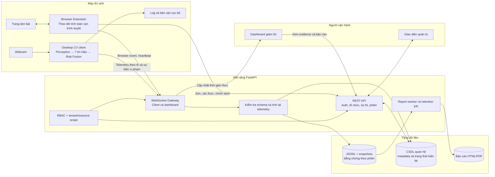
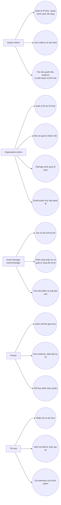
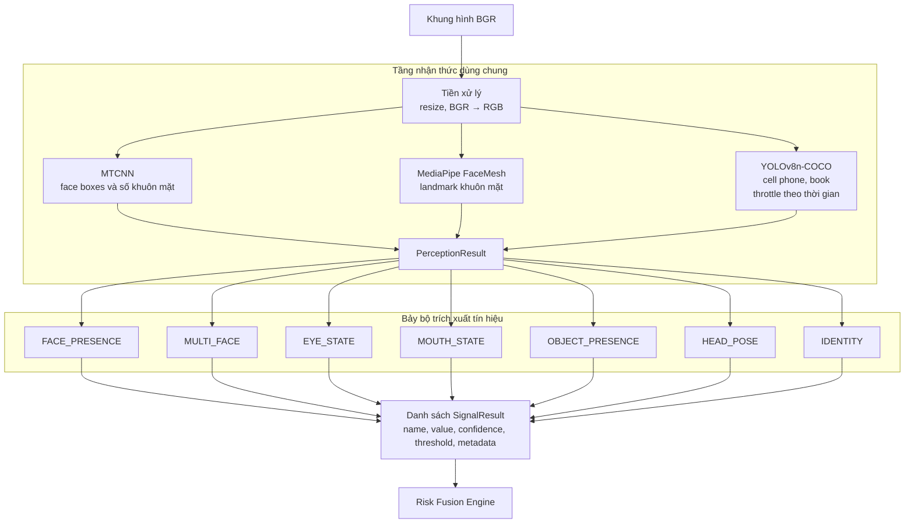
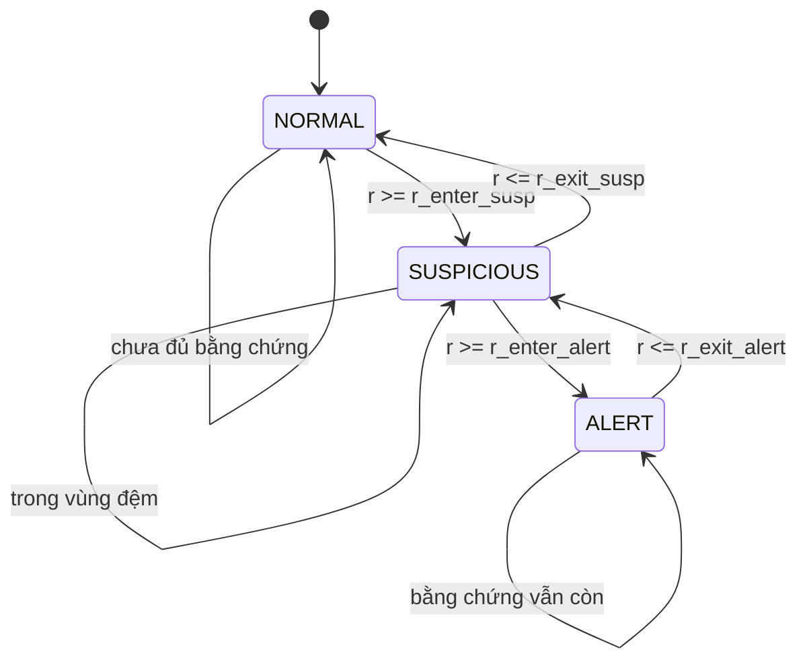
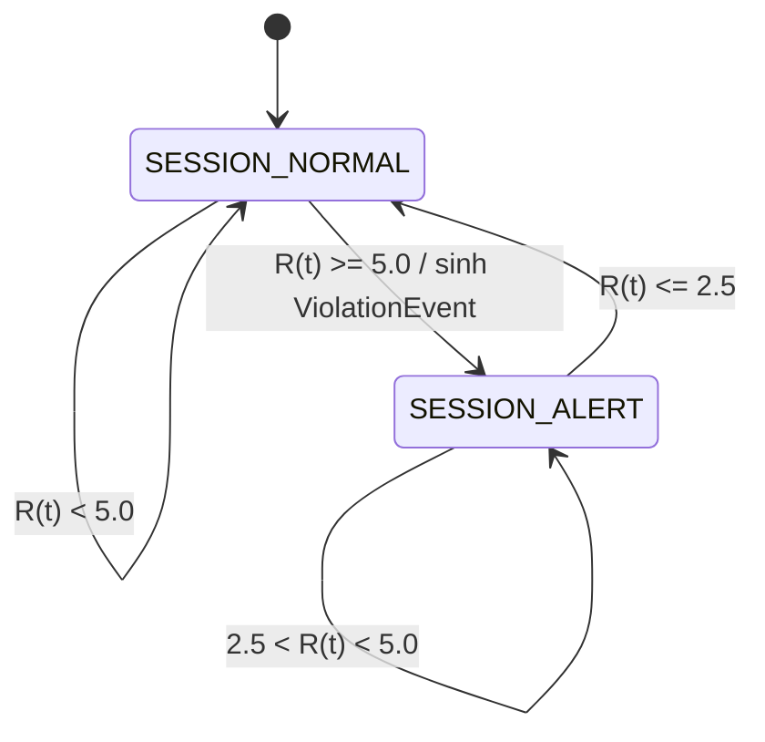
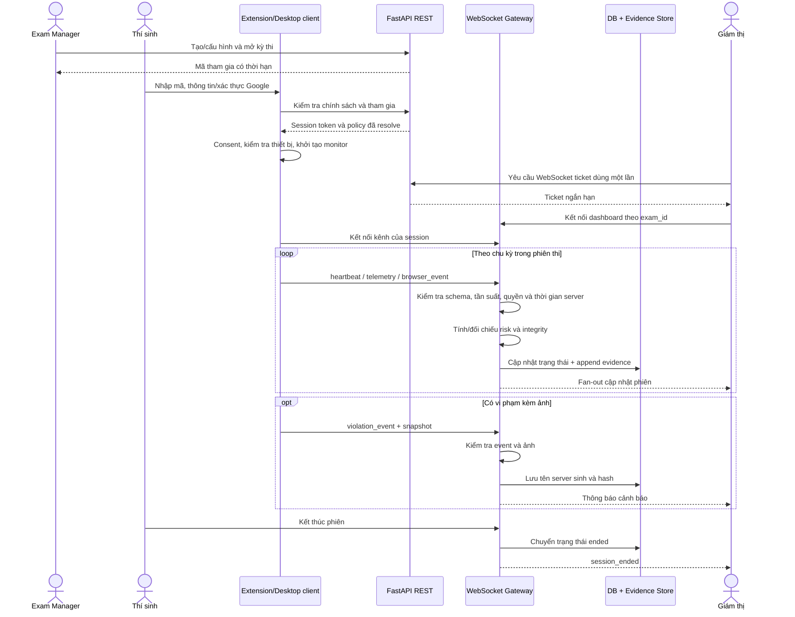
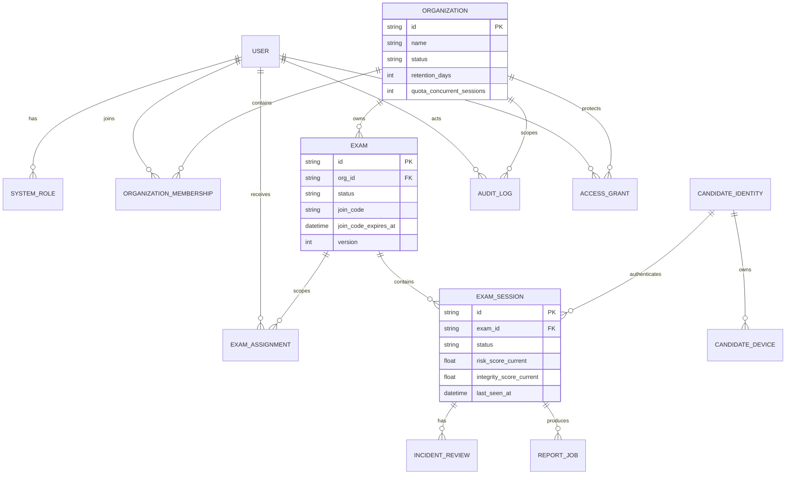
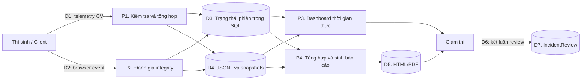

# Chương 4. Các giải pháp và đóng góp nổi bật

## 4.0. Mở đầu

Các chương trước đã trình bày cơ sở lý thuyết của MTCNN, MediaPipe FaceMesh, YOLOv8, FaceNet, bài toán ước lượng góc quay đầu và nguyên lý kết hợp đa tín hiệu. Vì vậy, chương này không lặp lại cách hoạt động của từng mô hình, mà tập trung vào các vấn đề kỹ thuật đã xuất hiện khi xây dựng một hệ thống giám sát thi hoàn chỉnh và những giải pháp đã được thiết kế, cài đặt để giải quyết các vấn đề đó.

Đóng góp của đồ án không nằm ở việc huấn luyện một mô hình thị giác máy tính mới. Điểm nổi bật là việc tổ chức các mô hình có sẵn thành một pipeline có trạng thái, kết hợp kết quả thị giác máy tính với dữ liệu toàn vẹn trình duyệt, xây dựng lớp nền tảng nhiều tổ chức, truyền trạng thái theo thời gian thực, quản lý bằng chứng và tạo báo cáo có thể truy vết. Mỗi giải pháp trong chương được trình bày theo ba nội dung: bài toán đặt ra, giải pháp thực hiện và kết quả đạt được.

## 4.1. Giải pháp kiến trúc tổng thể cho hệ thống giám sát thi

### 4.1.1. Bài toán và yêu cầu kiến trúc

Một chương trình chỉ đọc webcam và hiển thị nhãn bất thường chưa đủ để vận hành một kỳ thi. Hệ thống thực tế phải đồng thời giải quyết nhiều nhóm yêu cầu: xử lý hình ảnh tại máy thí sinh; giám sát các thao tác trong trình duyệt; xác thực và phân quyền người dùng; quản lý tổ chức, kỳ thi và phiên thi; chuyển trạng thái đến giám thị theo thời gian thực; lưu bằng chứng; và tổng hợp báo cáo sau kỳ thi.

Nếu ghép toàn bộ trách nhiệm vào một chương trình đơn khối, ba vấn đề xuất hiện. Thứ nhất, các mô hình thị giác máy tính có chi phí tính toán lớn và không phù hợp để chạy đồng bộ trong backend phục vụ nhiều người dùng. Thứ hai, truyền video liên tục làm tăng băng thông, chi phí lưu trữ và mức độ nhạy cảm của dữ liệu. Thứ ba, giao diện quản trị, dữ liệu phiên và thuật toán nhận diện bị phụ thuộc chặt vào nhau, gây khó kiểm thử và mở rộng.

### 4.1.2. Giải pháp

Đồ án tách hệ thống thành ba thành phần triển khai chính:

- **Client desktop Python** thực hiện pipeline thị giác máy tính trên webcam, đăng ký khuôn mặt, kiểm tra liveness cơ bản, tính bảy tín hiệu và tổng hợp điểm rủi ro ngay tại máy thí sinh.
- **Browser Extension** quản lý luồng tham gia kỳ thi trong trình duyệt, kiểm tra chính sách thiết bị và ghi nhận các sự kiện như rời toàn màn hình, chuyển tab, mất focus, thao tác clipboard, camera hoặc chia sẻ màn hình bị dừng.
- **Backend FastAPI và dashboard** quản lý tổ chức, tài khoản, kỳ thi, phiên thi, phân quyền, kết nối WebSocket, lưu bằng chứng, hỗ trợ giám thị xem lại sự cố và sinh báo cáo.

Kiến trúc tổng thể được minh họa ở Hình 4.1.



**Hình 4.1. Kiến trúc tổng thể của hệ thống**

Quyết định quan trọng của kiến trúc là không truyền luồng video liên tục lên server. Client chỉ gửi telemetry đã gom theo chu kỳ, mặc định một giây, và ảnh chụp tại thời điểm có sự kiện cần làm bằng chứng. Backend không chạy mô hình CV, nhưng cũng không tin hoàn toàn dữ liệu client: message phải đúng schema, chứa đủ bảy tín hiệu; điểm rủi ro, trạng thái, mức nghiêm trọng và tín hiệu đóng góp được server tính hoặc đối chiếu lại trước khi lưu và chuyển tiếp.

### 4.1.3. Kết quả đạt được

Kiến trúc trên tạo ra ranh giới rõ ràng giữa xử lý nhận diện, giám sát trình duyệt, vận hành nền tảng và lưu trữ. Pipeline CV vẫn có thể chạy cục bộ khi backend bị tắt; backend và dashboard không phụ thuộc vào thư viện học sâu; còn giao diện giám thị chỉ nhận dữ liệu cần thiết thay vì video liên tục. Cách tách này giúp giảm băng thông và giảm phạm vi dữ liệu hình ảnh phải truyền qua mạng.

Hệ thống hiện hỗ trợ hai nhánh client là desktop CV và browser extension. Tuy nhiên, hai nhánh chưa được hợp nhất hoàn toàn vào cùng một phiên bằng native-messaging bridge. Đây là giới hạn được công bố rõ: kiến trúc đã chuẩn bị các hợp đồng dữ liệu chung, nhưng việc tích hợp đồng thời webcam CV native và extension trong một phiên là hướng phát triển tiếp theo.

## 4.2. Giải pháp mô hình hóa tác nhân, use case và phân quyền

### 4.2.1. Bài toán quản lý nhiều phạm vi người dùng

Trong một hệ thống giám sát thi, “quản trị viên” không phải là một vai trò duy nhất. Người quản trị nền tảng cần quản lý tổ chức nhưng không nên mặc nhiên xem dữ liệu nhạy cảm của thí sinh. Quản trị viên tổ chức cần quản lý thành viên và chính sách nhưng không nhất thiết vận hành kỳ thi. Người tạo kỳ thi, người quản lý kỳ thi và giám thị lại có quyền khác nhau trên từng kỳ thi cụ thể. Ngoài ra, thí sinh chỉ được truy cập đúng phiên của mình, không dùng chung cơ chế xác thực với nhân sự quản trị.

Nếu chỉ kiểm tra một trường `role` toàn cục, một người là quản lý ở kỳ thi A có thể bị hiển thị nhầm quyền quản lý ở kỳ thi B, hoặc người thuộc tổ chức này có thể suy đoán sự tồn tại của tài nguyên thuộc tổ chức khác.

### 4.2.2. Giải pháp

Đồ án xây dựng kiểm soát truy cập theo ba bước: xác thực danh tính, xác định phạm vi và kiểm tra capability trên tài nguyên. Các vai trò và use case chính được thể hiện ở Hình 4.2.



**Hình 4.2. Use case theo các vai trò của hệ thống**

Ở tầng dữ liệu, quyền được biểu diễn bởi ba loại quan hệ:

- `SystemRole` gán vai trò `system_admin` ngoài phạm vi một tổ chức.
- `OrganizationMembership` gán `org_admin` hoặc `exam_manager` trong một tổ chức đang hoạt động.
- `ExamAssignment` gán `owner`, `manager` hoặc `proctor` trên từng kỳ thi.

Backend không phân quyền bằng các câu lệnh điều kiện rải rác trong từng API. Các capability như `exam.manage`, `exam.monitor`, `exam.evidence.read` và `exam.reports.export` được giải quyết tập trung. Khi truy cập một kỳ thi hoặc phiên, hệ thống kiểm tra đồng thời trạng thái tài khoản, tổ chức hiện hành, membership, assignment, thời hạn và loại hành động. Tài nguyên ngoài tenant hoặc kỳ thi chưa được phân công thường trả về `404` để hạn chế tiết lộ sự tồn tại; trường hợp đã đúng phạm vi nhưng thiếu capability trả về `403`.

System Admin phải bật MFA mới có vai trò hệ thống hiệu lực. Vai trò này không có đường truy cập mặc định đến evidence của thí sinh. Khi cần hỗ trợ sự cố, người quản trị phải có `AccessGrant` chỉ đọc, thuộc đúng tổ chức, còn thời hạn và chưa bị thu hồi. Thao tác nhạy cảm được liên kết với `AuditLog` để lưu chủ thể, phạm vi, hành động, kết quả, lý do, request ID và trạng thái trước/sau.

Thí sinh được tách khỏi bảng tài khoản nhân sự. Chế độ thủ công tạo phiên từ mã dự thi và thông tin thí sinh; chế độ Google lưu các claim OIDC tối thiểu trong `CandidateIdentity`, không lưu access token hoặc refresh token của Google. Token phiên thí sinh và token người dùng có loại riêng, không thể dùng thay thế cho nhau.

### 4.2.3. Kết quả đạt được

Giải pháp đã tạo được mô hình quản trị đa tổ chức và giới hạn quyền theo từng tài nguyên. Một Exam Manager chỉ liệt kê được các kỳ thi mình được phân công; vai trò manager ở kỳ thi này không làm phát sinh quyền quản lý ở kỳ thi khác. Organization Admin được tách khỏi công việc vận hành kỳ thi, còn System Admin chỉ đọc dữ liệu giám sát khi có quyền ngoại lệ hợp lệ.

Các trường hợp cô lập tenant, thu hồi role/assignment, nhầm loại token, quyền WebSocket và quyền trên từng kỳ thi đã được đưa vào kiểm thử hồi quy. Nhờ đó, phân quyền không chỉ tồn tại ở giao diện mà được thực thi tại backend đối với REST, WebSocket và thao tác tải tệp.

## 4.3. Giải pháp pipeline nhận thức và trích xuất tín hiệu dùng chung

### 4.3.1. Bài toán xử lý nhiều mô hình trên mỗi khung hình

Bảy tín hiệu giám sát không hoàn toàn độc lập về dữ liệu đầu vào. Face Presence, Multi-face và Identity cần vùng khuôn mặt; Eye State, Mouth State và Head Pose cần landmark; Object Presence cần kết quả phát hiện vật thể. Nếu mỗi tín hiệu tự tải mô hình và tự xử lý lại khung hình, cùng một phép phát hiện sẽ chạy nhiều lần, làm giảm tốc độ và khiến các tín hiệu sử dụng kết quả không đồng nhất về thời điểm.

Ngoài ra, YOLOv8 có chi phí lớn hơn các bước xử lý còn lại. Chạy YOLO ở mọi frame gây lãng phí tài nguyên, nhưng nếu bỏ trống kết quả ở các frame không chạy model thì bộ đếm thời gian xuất hiện vật thể sẽ bị ngắt sai.

### 4.3.2. Giải pháp

Pipeline được tổ chức thành ba tầng xử lý nội bộ, minh họa ở Hình 4.3.



**Hình 4.3. Kiến trúc pipeline thị giác máy tính**

Tầng nhận thức chỉ chạy mỗi detector một lần rồi đóng gói dữ liệu vào `PerceptionResult`. Mọi Signal Extractor tuân theo cùng hợp đồng `process(PerceptionResult) -> SignalResult`. Nhờ hợp đồng này, thuật toán từng tín hiệu có thể phát triển và kiểm thử độc lập với camera và model thật.

YOLO được giới hạn tần suất theo thời gian với chu kỳ mặc định 0,4 giây. Trong khoảng giữa hai lần suy luận, pipeline giữ lại kết quả vật thể gần nhất thay vì trả danh sách rỗng. Object Signal sau đó yêu cầu vật thể xuất hiện liên tục tối thiểu một giây. Hai cơ chế phối hợp giúp giảm chi phí suy luận mà vẫn duy trì ngữ nghĩa thời gian.

Mỗi lời gọi detector được bọc bằng cơ chế dự phòng. Nếu một detector lỗi tạm thời trên một frame, pipeline trả kết quả rỗng hoặc dùng kết quả vật thể gần nhất thay vì làm kết thúc toàn bộ phiên thi. Thời gian xử lý của từng bước cũng được ghi lại để xác định nút thắt hiệu năng.

Bảng 4.1 tóm tắt vai trò triển khai của bảy tín hiệu. Công thức chi tiết của EAR, tỉ lệ mở miệng, PnP và cosine similarity đã được trình bày ở Chương 2 nên không lặp lại tại đây.

| Tín hiệu | Dữ liệu dùng chung | Cách ổn định chính | Tham số cấu hình hiện tại |
|---|---|---|---|
| `FACE_PRESENCE` | Face boxes | Chỉ bất thường khi vắng mặt đủ lâu | 2,0 giây |
| `MULTI_FACE` | Face boxes | Lọc khuôn mặt có độ tin cậy thấp | confidence ≥ 0,90 |
| `EYE_STATE` | Face landmarks | Kết hợp hai mắt và thời lượng nhắm | EAR 0,21; 1,0 giây |
| `MOUTH_STATE` | Face landmarks | Tỉ lệ chuẩn hóa và cửa sổ hoạt động theo thời gian | cửa sổ 2,0 giây; activity ratio 0,25 |
| `OBJECT_PRESENCE` | YOLO boxes | Throttle model và debounce thời lượng | 1,0 giây; model lọc phone/book |
| `HEAD_POSE` | Face landmarks | Ngưỡng yaw/pitch và thời lượng quay | 20°; 1,0 giây |
| `IDENTITY` | Face crop/embedding | Hai mức cosine, kiểm tra lại định kỳ và yêu cầu lỗi liên tiếp | 30 giây; warn 0,55; alert 0,40 |

### 4.3.3. Kết quả đạt được

Pipeline đã cài đặt đủ bảy lớp tín hiệu theo một interface chung. Có thể thay detector bằng fake trong unit test, đồng thời vẫn có smoke test với các model thật và kiểm thử tích hợp trên video mẫu. Các trường hợp detector lỗi, thiếu landmark, khuôn mặt xuất hiện lại, vật thể chỉ xuất hiện thoáng qua và identity chưa enrollment đều được xử lý mà không làm crash pipeline.

So với cách dùng bộ đếm số frame, nhiều điều kiện trong đồ án được quy đổi sang giây và cửa sổ thời gian. Vì vậy, ý nghĩa của ngưỡng ít phụ thuộc hơn vào FPS của máy. Việc chuẩn hóa độ mở miệng theo kích thước khuôn mặt cũng giảm ảnh hưởng của khoảng cách giữa thí sinh và camera.

## 4.4. Giải pháp kết hợp đa tín hiệu theo thời gian

### 4.4.1. Bài toán báo động giả và dao động trạng thái

Kết quả của một frame đơn lẻ không đủ để kết luận hành vi bất thường. Người dùng có thể chớp mắt, nhìn sang bên trong thời gian ngắn hoặc một detector có thể nhận nhầm vật thể ở đúng một frame. Nếu ghi một vi phạm cho mọi frame vượt ngưỡng, log sẽ bị ngập bởi các sự kiện lặp và giám thị khó phân biệt hành vi kéo dài với nhiễu tức thời.

Một ngưỡng duy nhất cũng làm trạng thái liên tục bật/tắt khi điểm số dao động gần biên. Ngoài ra, các hành vi không có mức nghiêm trọng như nhau: không khớp danh tính hoặc có điện thoại cần đóng góp nhiều hơn một lần nhắm mắt.

### 4.4.2. Giải pháp

Đồ án áp dụng hai cấp trạng thái. Cấp thứ nhất là một state machine độc lập cho từng tín hiệu. Trong cửa sổ trượt mặc định bốn giây, hệ thống tính:

$$
r_i(t)=\frac{N_{i,\text{vượt ngưỡng}}(t-W,t)}{N_{i,\text{hợp lệ}}(t-W,t)}
$$

với $W$ là độ dài cửa sổ và $r_i(t)$ là tỉ lệ quan sát bất thường của tín hiệu $i$. State machine có ba trạng thái `NORMAL`, `SUSPICIOUS` và `ALERT`. Ngưỡng đi vào trạng thái cao hơn lớn hơn ngưỡng đi ra, tạo hysteresis ngay bên trong từng tín hiệu.



**Hình 4.4. State machine độc lập của một tín hiệu**

Ở cấp thứ hai, các trạng thái được ánh xạ thành `NORMAL = 0`, `SUSPICIOUS = 1`, `ALERT = 2`. Điểm rủi ro phiên được tính bằng:

$$
R(t)=\sum_{i=1}^{7} w_i s_i(t)
$$

trong đó $w_i$ là trọng số tín hiệu đọc từ tệp cấu hình và $s_i(t)$ là giá trị trạng thái. Cấu hình hiện tại sử dụng trọng số: Identity 3,0; Object Presence 2,5; Face Presence 2,0; Multi-face 2,0; Eye State 1,0; Mouth State 1,0; Head Pose 1,0. Các giá trị này không được hard-code trong thuật toán mà được tập trung tại `config/fusion.yaml` để có thể hiệu chỉnh có kiểm soát.

Trạng thái phiên sử dụng hai ngưỡng: chuyển từ `SESSION_NORMAL` sang `SESSION_ALERT` khi $R(t) \geq 5,0$ và chỉ trở về bình thường khi $R(t) \leq 2,5$. Vùng giữa hai ngưỡng giữ nguyên trạng thái trước đó. Một `ViolationEvent` chỉ được sinh tại cạnh lên, tức thời điểm phiên vừa chuyển sang cảnh báo; hệ thống không tạo lại sự kiện ở mỗi frame trong khi cảnh báo còn kéo dài.



**Hình 4.5. Hysteresis ở cấp phiên thi**

Khi tạo sự kiện, engine lưu điểm rủi ro, mức nghiêm trọng, tín hiệu đóng góp, loại vi phạm chính và đường dẫn ảnh chụp. Vi phạm chính là tín hiệu có tích $w_i \times s_i$ lớn nhất tại thời điểm cạnh lên. Cách chọn này vẫn hoạt động khi cảnh báo được tạo bởi nhiều tín hiệu `SUSPICIOUS` cộng dồn mà chưa có tín hiệu riêng lẻ ở `ALERT`.

### 4.4.3. Kết quả đạt được

Giải pháp loại bỏ việc sinh cảnh báo lặp theo frame và cho phép nhiều tín hiệu tác động đồng thời đến một quyết định. State machine của bảy tín hiệu được cập nhật độc lập nên một tín hiệu trở lại bình thường không xóa lịch sử của tín hiệu khác. Tất cả transition, timeline điểm rủi ro và sự kiện vi phạm đều có thể được lưu để giải thích quyết định sau kỳ thi.

Các kiểm thử đã bao phủ các tình huống: chưa vượt ngưỡng không sinh sự kiện; cạnh lên sinh đúng một sự kiện; trạng thái cảnh báo kéo dài không tạo bản ghi trùng; phiên có thể trở lại bình thường và cảnh báo lại; nhiều tín hiệu cùng đóng góp; mức nghiêm trọng cao; ảnh snapshot và transition được ghi đúng. Tuy nhiên, trọng số và ngưỡng hiện tại là cấu hình khởi tạo đã được kiểm chứng về logic, chưa phải kết quả tối ưu hóa trên một bộ dữ liệu thực lớn có ground truth.

## 4.5. Giải pháp giám sát thời gian thực và kiểm chứng telemetry

### 4.5.1. Bài toán truyền trạng thái từ client không đáng tin cậy hoàn toàn

Giám thị cần thấy thay đổi của nhiều phiên gần như tức thời. Polling REST liên tục tạo độ trễ và tải thừa, trong khi WebSocket cho phép cập nhật hai chiều nhưng phát sinh rủi ro khác: token có thể bị lộ trong URL, message có thể bị giả mạo hoặc gửi quá nhanh, timestamp của client có thể sai và kết nối có thể mất mà dashboard không nhận biết.

### 4.5.2. Giải pháp

Hệ thống sử dụng hai kênh WebSocket tách biệt: kênh client của từng phiên và kênh dashboard theo kỳ thi. Browser WebSocket không truyền JWT trong query string. Dashboard trước tiên gọi REST để nhận một ticket dùng một lần, tồn tại ngắn, sau đó đưa ticket qua subprotocol khi mở kết nối. Client desktop sử dụng token phiên riêng.

Trình tự xử lý một phiên được mô tả trong Hình 4.6.



**Hình 4.6. Sequence diagram của một phiên thi được giám sát**

Mọi message được ánh xạ vào schema chặt, giới hạn kích thước và tần suất. Backend dùng timestamp nhận tại server làm thời gian chuẩn; timestamp client chỉ phục vụ truy vết. Với telemetry CV, server yêu cầu đủ bảy signal và đối chiếu lại risk/state/severity/contribution. Với sự kiện trình duyệt, server xác định mức nghiêm trọng theo chính sách kỳ thi và tự tính `integrity_score`, không nhận điểm toàn vẹn do extension tự khai báo.

Heartbeat và idle timeout được dùng để phân biệt các trạng thái `pending`, `active`, `disconnected` và `ended`. Khi nhận cập nhật hợp lệ, backend vừa lưu bản sao trạng thái mới nhất vào SQL để dashboard tải nhanh, vừa append dữ liệu chi tiết vào evidence store. Connection manager fan-out bản cập nhật đến các dashboard đúng kỳ thi.

Ảnh bằng chứng chỉ chấp nhận JPEG hoặc PNG, giới hạn 2 MiB, kiểm tra magic bytes, kích thước ảnh và hash. Tên file do server sinh, không sử dụng đường dẫn client gửi. Việc tải ảnh và báo cáo cũng phải đi lại qua kiểm tra quyền của đúng tổ chức và đúng phiên.

### 4.5.3. Kết quả đạt được

Giám thị có thể theo dõi risk CV, integrity trình duyệt, thiết bị, kết nối và phiên thi theo thời gian thực mà không cần tải lại trang. Khi client mất heartbeat, trạng thái phiên được chuyển thành `disconnected` cùng lý do; khi kết nối lại, hệ thống tiếp tục nhận dữ liệu theo phiên hợp lệ.

Backend không còn là bộ chuyển tiếp mù quáng dữ liệu do client khai báo. Các kiểm thử tích hợp đã kiểm tra ticket một lần, schema sự kiện, tính lại điểm ở server, cô lập WebSocket giữa các tổ chức, upload snapshot và kết thúc phiên. Dù vậy, một client chạy trên thiết bị do thí sinh toàn quyền kiểm soát vẫn có thể bị sửa để phát chuỗi telemetry giả nhưng nhất quán. Giải pháp hiện tại làm tăng khả năng phát hiện sai lệch và truy vết, không thay thế remote attestation hoặc lockdown browser.

## 4.6. Giải pháp mô hình dữ liệu lai và luồng bằng chứng

### 4.6.1. Bài toán lưu trạng thái vận hành và dữ liệu chuỗi thời gian

Dashboard cần truy vấn nhanh danh sách kỳ thi, người dùng và trạng thái mới nhất của phiên. Ngược lại, tín hiệu theo thời gian, transition, sự kiện trình duyệt và vi phạm là dữ liệu append-only có số lượng lớn, phù hợp với xử lý tuần tự và sinh báo cáo. Nếu đưa toàn bộ frame-level telemetry vào cơ sở dữ liệu quan hệ, schema trở nên nặng và mỗi frame có thể gây một transaction. Nếu chỉ lưu file, việc lọc theo tổ chức, phân quyền và tải trạng thái ban đầu cho dashboard trở nên khó khăn.

### 4.6.2. Giải pháp

Đồ án sử dụng mô hình dữ liệu lai:

- **Cơ sở dữ liệu quan hệ** lưu identity, tổ chức, membership, role, kỳ thi, assignment, phiên thi, trạng thái hiện tại, review, report job và audit log.
- **Kho evidence theo phiên** lưu metadata, tín hiệu, transition, timeline risk, sự kiện trình duyệt, vi phạm và ảnh snapshot dưới dạng JSON/JSONL và tệp ảnh.

Sơ đồ quan hệ chính được trình bày ở Hình 4.7.



**Hình 4.7. ERD rút gọn của lớp nền tảng**

Luồng dữ liệu từ lúc phát sinh đến lúc giám thị xem báo cáo được mô tả ở Hình 4.8.



**Hình 4.8. Sơ đồ luồng dữ liệu bằng chứng và báo cáo**

Mỗi thư mục `sessions/<session_id>/` có cấu trúc thống nhất:

```text
session_meta.json
signals.jsonl
state_transitions.jsonl
browser_events.jsonl
violations.jsonl
risk_score_timeline.jsonl
snapshots/
report.html
report.pdf
```

Các tệp JSONL chỉ được append vào danh sách tên cho phép. `ExamSession.risk_score_current`, `session_state_current`, `integrity_score_current` và trạng thái thiết bị là bản sao mới nhất phục vụ truy vấn nhanh, còn các JSONL là nguồn chi tiết để dựng timeline và báo cáo. `IncidentReview` lưu đánh giá của con người tách khỏi sự kiện vi phạm gốc, nhờ đó kết quả máy không bị sửa khi giám thị xác nhận hoặc bác bỏ một sự cố.

Report job được đưa vào hàng đợi nền với trạng thái `pending`, `processing`, `failed` hoặc `completed`. Retention job có chế độ dry-run trước khi áp dụng; khi dọn dữ liệu hết hạn, hệ thống xử lý evidence, review/report liên quan, ẩn danh phiên và ghi AuditLog.

### 4.6.3. Kết quả đạt được

Mô hình lai đáp ứng đồng thời hai kiểu tải: dashboard lấy trạng thái mới nhất từ SQL mà không phải đọc lại toàn bộ log, trong khi module reporting vẫn đọc được chuỗi thời gian đầy đủ từ thư mục phiên. Schema `SignalResult` và `ViolationEvent` được dùng xuyên suốt từ client, backend đến báo cáo nên không cần chuyển đổi sang một định dạng trung gian khác.

Trình đọc báo cáo có khả năng dung nạp file thiếu hoặc phiên bị dừng giữa chừng; dữ liệu còn lại vẫn được tổng hợp thay vì làm hỏng toàn bộ báo cáo. Hệ thống đã tạo được báo cáo HTML/PDF gồm thống kê, bảng vi phạm, biểu đồ điểm rủi ro, sự kiện integrity và ảnh bằng chứng. Dữ liệu tổng hợp quy mô lớn được dùng để kiểm thử tải và báo cáo, nhưng không được coi là bằng chứng đánh giá độ chính xác của mô hình.

## 4.7. Giải pháp bảo vệ phiên, chính sách và dữ liệu nhạy cảm

### 4.7.1. Bài toán an toàn hệ thống

Hệ thống giám sát thi xử lý thông tin định danh, hành vi và hình ảnh của thí sinh. Các rủi ro không chỉ nằm ở việc đăng nhập sai mật khẩu mà còn gồm lộ token qua URL, nhầm token người dùng với token phiên, truy cập chéo tổ chức, path traversal khi tải ảnh, replay WebSocket ticket, dữ liệu HTML không an toàn, thay đổi cấu hình kỳ thi đồng thời và chính sách cấp dưới làm yếu yêu cầu bảo mật của cấp trên.

### 4.7.2. Giải pháp

Đồ án triển khai bảo vệ theo nhiều lớp:

1. **Xác thực và phiên:** mật khẩu được băm; JWT giao diện quản trị nằm trong cookie `HttpOnly`, `SameSite=Strict`; System Admin bắt buộc MFA; thay đổi membership hoặc assignment làm phiên cũ mất hiệu lực thông qua version thu hồi.
2. **OAuth:** luồng Google sử dụng state, PKCE, nonce và grant một lần. Hệ thống chỉ lưu claim tối thiểu và hash của device token.
3. **Kênh truyền:** WebSocket dashboard dùng ticket ngắn hạn dùng một lần, không đặt bearer token trong URL. Message bị giới hạn schema, kích thước, tần suất và có heartbeat.
4. **Cô lập dữ liệu:** mọi truy vấn kỳ thi/phiên đi qua kiểm tra tenant và assignment. Evidence chỉ được phục vụ từ thư mục phiên đã xác định bởi server.
5. **Bảo vệ giao diện và tệp:** dashboard dựng dữ liệu động bằng API DOM an toàn; backend đặt CSP, `X-Content-Type-Options`, `X-Frame-Options`, `Referrer-Policy` và HSTS khi dùng HTTPS. Ảnh upload được kiểm tra nội dung và tên file do server sinh.
6. **Chính sách phân tầng:** policy kỳ thi được resolve theo sàn nền tảng, chính sách tổ chức và cấu hình kỳ thi. Cấp dưới không thể làm yếu trường bắt buộc của cấp trên.
7. **Tính nhất quán vận hành:** kỳ thi có lifecycle `draft`, `scheduled`, `open`, `closed`, `archived`; join code có hạn và có thể xoay; trường `version` hỗ trợ optimistic locking khi nhiều người cùng chỉnh sửa.

### 4.7.3. Kết quả đạt được

Các đường REST, WebSocket và download evidence cùng sử dụng một mô hình phạm vi thay vì chỉ ẩn nút ở frontend. Hệ thống đã có kiểm thử cho rate limit đăng nhập, MFA, token confusion, policy inheritance, quota phiên đồng thời, cô lập tổ chức, quyền truy cập theo assignment, snapshot traversal và security header.

Giải pháp làm cho hệ thống phù hợp với mục tiêu nghiên cứu và triển khai có kiểm soát, nhưng chưa thể được xem là một lockdown browser hoàn chỉnh. Extension không quan sát được ứng dụng ngoài trình duyệt, điện thoại thứ hai hoặc máy ảo; Google login chỉ chứng minh quyền sở hữu tài khoản, không chứng minh người ngồi trước camera; blink liveness cơ bản chặn ảnh tĩnh nhưng không thay thế anti-spoofing chuyên dụng trước video replay hoặc deepfake. Với kỳ thi rủi ro cao, cần thêm managed browser, extension/client được ký và force-install, secure boot/attestation, HTTPS bắt buộc, object storage, backup và quy trình bảo vệ dữ liệu chính thức.

## 4.8. Đánh giá tổng hợp các đóng góp

### 4.8.1. Bài toán đánh giá đóng góp ở cấp hệ thống

Một hệ thống có nhiều module dễ tạo cảm giác “nhiều chức năng”, nhưng số lượng màn hình không phản ánh chất lượng kỹ thuật. Đóng góp cần được xem xét theo khả năng giải quyết các mâu thuẫn thực tế: độ nhạy và báo động giả; tính thời gian thực và băng thông; khả năng truy vấn và khả năng lưu chuỗi sự kiện; quyền quản trị và quyền riêng tư; tự động phát hiện và quyền kết luận của con người.

### 4.8.2. Giải pháp và giá trị đóng góp

Các đóng góp chính của đồ án có thể tổng quát hóa như sau:

- **Kiến trúc phân rã theo trách nhiệm:** đưa xử lý CV về client, đưa quản trị và kiểm chứng dữ liệu về backend, tách browser integrity khỏi risk CV nhưng hợp nhất hai loại bằng chứng trên dashboard và báo cáo.
- **Pipeline nhận thức dùng chung:** chạy detector nền tảng một lần cho mỗi frame, chia sẻ `PerceptionResult` cho bảy Signal Extractor và dùng interface thống nhất để kiểm thử độc lập.
- **Mô hình quyết định hai cấp có trạng thái:** kết hợp cửa sổ thời gian, hysteresis trên từng tín hiệu, weighted fusion và hysteresis cấp phiên; chỉ sinh sự kiện ở cạnh lên để hạn chế log trùng.
- **Dữ liệu có khả năng giải thích:** lưu tín hiệu đóng góp, transition, risk timeline, browser event và snapshot thay vì chỉ lưu một nhãn “gian lận”.
- **Nền tảng nhiều tổ chức có phân quyền theo tài nguyên:** tách System Admin, Organization Admin, Exam Manager và assignment theo kỳ thi; cung cấp quyền truy cập ngoại lệ có phê duyệt đối với dữ liệu nhạy cảm.
- **Phòng thủ phía server:** không tin điểm và đường dẫn do client khai báo; kiểm tra schema, dùng thời gian server, tính lại hoặc đối chiếu risk/integrity, kiểm tra ảnh và ghi audit.
- **Chu trình sau phát hiện:** hỗ trợ giám thị xem timeline, thực hiện incident review và tạo report job HTML/PDF, giữ kết luận của con người tách khỏi sự kiện máy.

### 4.8.3. Kết quả đạt được và giới hạn đánh giá

Tại thời điểm hoàn thành chương này, kho mã có 225 hàm kiểm thử tự động bao phủ từ công thức và state machine, pipeline CV, báo cáo, API, authentication, policy, tenant isolation đến WebSocket và giao diện quản trị. Ngoài unit test, dự án còn có smoke test với model thật, kiểm thử tích hợp video mẫu và luồng mô phỏng đầu-cuối tạo báo cáo thực. Kết quả này cho thấy kiến trúc và các hợp đồng dữ liệu có thể vận hành xuyên suốt các module.

Tuy nhiên, số lượng test phần mềm không đồng nghĩa với độ chính xác nhận diện ngoài thực tế. Để kết luận precision, recall, F1-score hoặc tỉ lệ báo động giả của từng tín hiệu, hệ thống cần một bộ video thật đủ đa dạng về ánh sáng, thiết bị, góc mặt và đặc điểm người dùng, kèm ground truth độc lập. Vì vậy, chương này chỉ khẳng định các kết quả đã được kiểm chứng về chức năng, tính nhất quán, khả năng chịu lỗi và an toàn truy cập; không đưa ra số liệu độ chính xác chưa có cơ sở thực nghiệm.

## 4.9. Kết chương

Chương 4 đã trình bày các giải pháp và đóng góp nổi bật của đồ án ở cấp hệ thống. Thay vì xử lý từng frame bằng các luật độc lập, đồ án xây dựng pipeline nhận thức dùng chung, bảy tín hiệu có hợp đồng thống nhất và cơ chế kết hợp hai cấp theo thời gian. Thay vì dừng ở một ứng dụng webcam, đồ án bổ sung extension giám sát trình duyệt, backend nhiều tổ chức, dashboard thời gian thực, mô hình phân quyền theo tài nguyên, kho bằng chứng và quy trình báo cáo.

Các kết quả cho thấy hệ thống đã hình thành một chuỗi xử lý có thể truy vết từ dữ liệu đầu vào, trạng thái tín hiệu, quyết định rủi ro, truyền nhận thời gian thực đến review và báo cáo. Đồng thời, chương cũng xác định rõ giới hạn của client chạy trên thiết bị người dùng, liveness cơ bản, phạm vi quan sát của extension và nhu cầu đánh giá trên bộ dữ liệu thật. Đây là cơ sở để chương tiếp theo trình bày chi tiết quá trình cài đặt, kiểm thử và đánh giá thực nghiệm của hệ thống.
