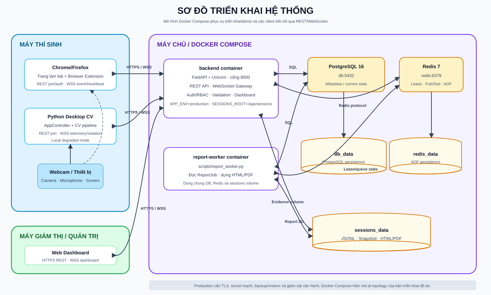

# Chương 5. Cài đặt hệ thống

## 5.1. Tổng quan

Chương 4 đã trình bày các giải pháp ở cấp kiến trúc. Chương này mô tả cách những giải pháp đó được hiện thực trong kho mã nguồn. Nội dung bám theo cấu trúc tệp, giao diện lập trình và thông số của phiên bản bàn giao; mã giả ở giai đoạn thiết kế không được sử dụng làm bằng chứng cài đặt.

Hệ thống gồm ba phần có vòng đời độc lập:

1. Ứng dụng Python trên máy tính để bàn chạy chuỗi xử lý thị giác máy tính và có thể hoạt động cục bộ.
2. Tiện ích mở rộng giám sát tính toàn vẹn trong phạm vi trình duyệt.
3. Dịch vụ FastAPI, bảng điều khiển và tiến trình nền thực hiện quản lý tập trung.

## 5.2. Công nghệ sử dụng

### 5.2.1. Thành phần thị giác máy tính trên máy tính để bàn

| Công nghệ | Vai trò |
|---|---|
| Python 3.11 | Ngôn ngữ chính của ứng dụng thị giác máy tính và dịch vụ phía máy chủ |
| OpenCV | Đọc webcam, thay đổi kích thước/chuyển màu, giải PnP, hiển thị giao diện và lưu ảnh |
| NumPy | Biểu diễn khung hình, véc-tơ và phép tính hình học |
| MediaPipe 0.10.14 | Face Landmarker theo Tasks API |
| `facenet-pytorch` | Cắt/căn chỉnh khuôn mặt bằng MTCNN và tạo véc-tơ đặc trưng bằng InceptionResnetV1 |
| Ultralytics YOLOv8 | Phát hiện `cell phone` và `book` bằng mô hình COCO |
| PyYAML/Pydantic | Đọc và kiểm tra cấu hình/hợp đồng dữ liệu |
| Jinja2, Matplotlib, xhtml2pdf | Sinh báo cáo HTML, biểu đồ và PDF |

Các phiên bản được giới hạn trong `requirements.txt` nhằm tránh xung đột giữa OpenCV, MediaPipe và NumPy. Mô hình Face Landmarker và YOLO được đặt trong thư mục `models/`; mô hình có thể được tải khi khởi tạo nếu chưa có.

### 5.2.2. Nền tảng web

| Công nghệ | Vai trò |
|---|---|
| FastAPI/Uvicorn | REST API, trang web và điểm cuối WebSocket |
| SQLAlchemy | ORM cho dữ liệu nền tảng |
| SQLite/PostgreSQL | SQLite cho phát triển; PostgreSQL cho Docker Compose |
| Redis | Giới hạn tần suất phân tán, quản lý quyền giữ kết nối và phát–nhận cập nhật bảng điều khiển khi được cấu hình |
| Jinja2 + JavaScript thuần | Bảng điều khiển và giao diện quản trị được kết xuất phía máy chủ |
| JWT, bcrypt, TOTP | Phiên đăng nhập, băm mật khẩu và MFA |
| Google Auth/OIDC | Xác thực Google cho nhân sự/thí sinh theo luồng tương ứng |

Vùng chứa phía máy chủ sử dụng `requirements-backend.txt` và không cài các mô hình thị giác máy tính có dung lượng lớn. Các mô-đun dùng chung chỉ được nạp khi cần, nhờ đó thành phần báo cáo có thể hoạt động mà không khởi tạo PyTorch, MediaPipe hoặc Ultralytics.

### 5.2.3. Tiện ích mở rộng trình duyệt

Tiện ích mở rộng sử dụng JavaScript theo WebExtensions API và Manifest V3. Kịch bản đóng gói tạo hai bản `dist/chrome` và `dist/firefox`; Chrome sử dụng tiến trình dịch vụ (service worker), còn Firefox sử dụng kịch bản nền và khai báo riêng cho Gecko. Việc không sử dụng khung giao diện phía máy khách giúp giảm kích thước gói và số thư viện phụ thuộc trong thành phần được coi là không hoàn toàn tin cậy.

## 5.3. Cấu trúc kho mã nguồn

Cấu trúc rút gọn của mã nguồn thực tế như sau:

```text
exam-proctor-extension-upgrade/
├── main.py
├── config/
│   └── fusion.yaml
├── src/
│   ├── app_config.py
│   ├── app_controller.py
│   ├── orchestrator.py
│   ├── client/
│   │   └── backend_client.py
│   ├── perception/
│   │   ├── pipeline.py
│   │   ├── perception_result.py
│   │   ├── face_detector.py
│   │   ├── face_mesh_detector.py
│   │   ├── object_detector.py
│   │   ├── face_embedder.py
│   │   └── head_pose_math.py
│   ├── signals/
│   │   ├── base.py
│   │   ├── factory.py
│   │   ├── face_presence.py, multi_face.py
│   │   ├── eye_state.py, mouth_state.py
│   │   ├── object_signal.py, head_pose.py
│   │   ├── identity.py, liveness.py
│   ├── fusion/
│   │   ├── signal_state_machine.py
│   │   ├── tracker.py, session.py, engine.py
│   │   ├── violation_event.py
│   │   └── *_logger.py
│   ├── reporting/
│   │   ├── data_loader.py, aggregator.py
│   │   ├── charts.py, report_generator.py
│   │   └── templates/report_template.html
│   └── ui/
├── extension/
│   ├── manifest.base.json
│   ├── src/
│   │   ├── setup.html, setup.js
│   │   ├── background.js
│   │   ├── content-monitor.js
│   │   └── common.js, styles.css
│   └── scripts/build.mjs
├── backend/
│   ├── main.py, models.py, db.py
│   ├── auth.py, authorization.py, policies.py
│   ├── ws_schemas.py, ws_manager.py, ws_tickets.py
│   ├── session_materializer.py
│   ├── routers/
│   ├── templates/
│   └── static/
├── scripts/
├── tests/ và backend/tests/
├── Dockerfile.backend
└── docker-compose.yml
```

Các gói mã nguồn được chia theo trách nhiệm thay vì theo từng màn hình. `main.py` chỉ khởi tạo các thành phần phụ thuộc và chạy vòng lặp camera; logic vòng đời phiên nằm trong `AppController`. Các bộ định tuyến phía máy chủ không cài đặt lại quy tắc phân quyền mà sử dụng tập trung `authorization.py`.

## 5.4. Cấu hình tập trung

`config/fusion.yaml` là nguồn cấu hình trung tâm cho ứng dụng thị giác máy tính. Tệp này gồm:

- Độ dài cửa sổ và bốn ngưỡng máy trạng thái của từng tín hiệu.
- Trọng số bảy tín hiệu và ngưỡng `T_enter/T_exit` cấp phiên.
- Tham số đặc thù như EAR, góc quay ngang/dọc, chu kỳ xác minh danh tính và thời lượng chống dao động.
- Camera, thư mục phiên, đăng ký khuôn mặt, kiểm tra sự hiện diện sống, định dạng báo cáo và kết nối máy chủ.

`AppConfig.from_yaml()` đọc phần cấu hình cấp ứng dụng. `build_signals_from_config()` tạo đúng bảy bộ trích xuất tín hiệu. `RiskFusionEngine.from_config()` tạo bộ theo dõi trạng thái, trọng số và vùng trễ từ cùng một tệp. Cách tổ chức này loại bỏ lỗi của phiên bản cũ, trong đó ngưỡng danh tính được viết cố định trong mã và khác với YAML.

Các giá trị chính đang sử dụng được trình bày ở Chương 4, Bảng 4.1. Mọi tham số được kiểm tra miền hợp lệ; ví dụ chu kỳ gửi dữ liệu giám sát phải dương, định dạng báo cáo chỉ nhận `html/pdf`, và `T_exit` phải nhỏ hơn `T_enter`.

Chính sách của nền tảng web không dùng trực tiếp `fusion.yaml`. Tệp `backend/policies.py` định nghĩa `PlatformPolicy`, `OrganizationPolicy` và `ResolvedExamPolicy`; máy chủ xác định mức sàn hệ thống, chính sách tổ chức và giá trị ghi đè của kỳ thi tại thời điểm tạo hoặc cập nhật.

## 5.5. Cài đặt ứng dụng thị giác máy tính trên máy tính để bàn

### 5.5.1. Vòng đời ứng dụng

`main.py` thực hiện bốn việc: đọc cấu hình, dựng bảy tín hiệu, dựng `PerceptionLayer`, tạo `AppController` và chạy vòng lặp webcam. Vòng đời phiên được biểu diễn bởi `AppState`:

```text
IDLE → ENROLLMENT → MONITORING → GENERATING_REPORT → ENDED
```

`AppController.step(frame)` là điểm xử lý duy nhất cho mỗi khung hình. Chuột và bàn phím được đưa qua `handle_mouse()` và `handle_key()`. Cấu trúc này thay cho nhiều vòng `while` tách biệt, giúp việc kết thúc phiên, đóng nhật ký và kiểm thử chuyển trạng thái nhất quán hơn.

Khi `backend.enabled=false`, người dùng có thể chạy hoàn toàn cục bộ. Khi bật kết nối máy chủ, màn hình IDLE yêu cầu tên và mã tham gia, gọi REST để nhận mã xác thực phiên rồi khởi tạo `BackendClient`. Việc mất kết nối máy chủ không làm chuỗi xử lý cục bộ dừng; dữ liệu được gửi theo khả năng tốt nhất của kết nối.

### 5.5.2. Tầng nhận thức

`PerceptionLayer.process(raw_frame_bgr)` thực hiện:

1. Resize giữ tỉ lệ và chuyển BGR sang RGB.
2. Chạy MTCNN để lấy danh sách `FaceBox`.
3. Chạy MediaPipe Face Landmarker cho khuôn mặt chính.
4. Chạy YOLO theo chu kỳ `object_detect_interval_sec`, mặc định 0,4 giây.
5. Đóng gói kết quả vào `PerceptionResult`.

YOLO không trả kết quả rỗng ở khung hình bị giới hạn tần suất mà dùng `_last_objects`. Mỗi bộ phát hiện được gọi qua `_safe_call()`: khi MTCNN/Face Landmarker gặp lỗi thì dùng kết quả thiếu an toàn; khi YOLO gặp lỗi thì giữ kết quả gần nhất. Thời gian từng bước được lưu trong `last_timings` để đo hiệu năng.

`PerceptionResult` chứa dấu thời gian, kích thước khung hình, khung bao khuôn mặt, điểm mốc khuôn mặt, khung bao vật thể và khung hình RGB. Bộ trích xuất tín hiệu không gọi lại bộ phát hiện, nhờ vậy kết quả của một khung hình có cùng mốc thời gian.

### 5.5.3. Hợp đồng bộ trích xuất tín hiệu

`src/signals/base.py` định nghĩa abstract `SignalExtractor` và dataclass `SignalResult`. Mỗi kết quả gồm:

```text
signal_name, timestamp, value,
exceeds_threshold, confidence, metadata
```

Các cài đặt cụ thể:

- `FacePresenceSignal` dùng timer vắng mặt.
- `MultiFaceSignal` lọc khung bao khuôn mặt theo độ tin cậy trước khi đếm.
- `EyeStateSignal` tính EAR từng mắt bằng tọa độ pixel và yêu cầu cả hai mắt cùng nhắm.
- `MouthStateSignal` tính tỉ lệ mở miệng và activity ratio trong cửa sổ.
- `ObjectSignal` đọc box đã lọc `cell phone/book` và debounce thời lượng.
- `HeadPoseSignal` gọi `solve_head_pose()` rồi theo dõi góc quay ngang/dọc vượt ngưỡng.
- `IdentitySignal` đăng ký nhiều vectơ đặc trưng, xác minh lại định kỳ, có vùng cảnh báo sớm và yêu cầu lỗi liên tiếp.

Khi thiếu điểm mốc, tín hiệu phụ thuộc vào điểm mốc trả độ tin cậy bằng 0 và không tự kết luận bất thường; tín hiệu hiện diện khuôn mặt xử lý nguyên nhân vắng mặt. Cách phân trách nhiệm tránh việc cùng một lỗi bộ phát hiện làm nhiều tín hiệu đồng loạt báo vi phạm.

### 5.5.4. Đăng ký khuôn mặt và kiểm tra sự hiện diện sống

Trong trạng thái ENROLLMENT, `BlinkLivenessChallenge` theo dõi chuỗi mở–nhắm–mở mắt. Chỉ sau khi thử thách đạt yêu cầu, bộ điều khiển mới thu khung hình để tạo vectơ đặc trưng tham chiếu. Số khung hình, số lần thử và thời hạn chờ được lấy từ cấu hình.

`IdentitySignal.enroll()` bỏ các khung hình không trích được khuôn mặt và lấy trung bình các vectơ đặc trưng hợp lệ. Nếu không có khung hình hợp lệ sau số lần thử, phiên được hủy với lý do đăng ký thất bại. Cơ chế xác minh sự hiện diện sống này là biện pháp cơ bản, không được cài đặt như một giải pháp chống phát lại chuyên dụng.

### 5.5.5. Bộ điều phối và tổng hợp rủi ro

`PipelineOrchestrator` gọi tầng nhận thức, lần lượt chạy toàn bộ tín hiệu và cập nhật máy trạng thái. Bộ điều phối còn ghi `signals.jsonl`, thống kê thời gian xử lý và đặt lại mọi tín hiệu khi bắt đầu phiên mới.

`SignalStateTracker` chứa một `SignalStateMachine` riêng cho từng tín hiệu. `RiskFusionEngine.update()` lưu kết quả mới nhất, cập nhật tracker, tính:

$$
R=\sum_i w_i\,stateValue_i
$$

sau đó gọi `SessionHysteresis`. Nếu lần chuyển trạng thái đi vào `SESSION_ALERT`, bộ tổng hợp tạo `ViolationEvent`, chọn vi phạm chính, lưu các tín hiệu đóng góp và ảnh chụp. Trong khi phiên vẫn ở trạng thái ALERT, lời gọi tiếp theo không tạo sự kiện trùng.

`StateTransitionLogger` và `RiskScoreLogger` ghi riêng lần chuyển trạng thái và dòng thời gian. Việc tách bộ ghi nhật ký cho phép mô-đun báo cáo đọc lại trạng thái mà không phải chạy lại mô hình.

### 5.5.6. Gửi dữ liệu đến dịch vụ phía máy chủ

`BackendClient` mở WebSocket nền và có hàng đợi gửi. Dữ liệu giám sát được gom theo `telemetry_interval_sec` thay vì gửi ở mọi khung hình. Sự kiện vi phạm được tuần tự hóa cùng các tín hiệu đóng góp; nếu có ảnh chụp, máy khách đọc chuỗi byte và gửi nội dung/giá trị băm thay vì gửi đường dẫn hệ thống tệp cục bộ.

Khi kết nối không thành công, hàm gửi không thực hiện thao tác nhưng vẫn được kiểm soát, còn phiên tiếp tục ghi tệp cục bộ. Điểm giới hạn là dữ liệu phát sinh trong thời gian ngoại tuyến chưa có cơ chế đồng bộ bù đầy đủ khi kết nối trở lại.

## 5.6. Cài đặt tiện ích mở rộng trình duyệt

### 5.6.1. Tệp khai báo và quyền

`manifest.base.json` khai báo các quyền `alarms`, `identity`, `scripting`, `storage`, `tabs` và quyền truy cập máy chủ ở dạng tùy chọn. Tiện ích chỉ yêu cầu nguồn của máy chủ/trang thi khi cần. Chính sách bảo mật nội dung của tiện ích giới hạn kịch bản và kiểu trình bày do chính tiện ích cung cấp, đồng thời chỉ cho phép kết nối HTTPS/WSS hoặc `localhost` phục vụ phát triển.

### 5.6.2. Luồng thiết lập

`setup.html/setup.js` cung cấp giao diện:

1. Nhập địa chỉ máy chủ và mã tham gia.
2. Lấy chính sách kỳ thi.
3. Chọn luồng thủ công hoặc Google.
4. Yêu cầu quyền truy cập đúng nguồn máy chủ.
5. Hiển thị nội dung xin sự đồng ý và kiểm tra điều kiện.
6. Gửi lệnh bắt đầu đến tiến trình nền.

Đăng nhập Google sử dụng `identity.launchWebAuthFlow()`. Máy chủ quản lý tham số `state`, PKCE, giá trị dùng một lần `nonce` và mã cấp quyền chỉ dùng một lần; tiện ích lưu mã xác thực thiết bị thí sinh có nội dung không thể suy đoán do hệ thống cấp, không lưu mã xác thực Google.

### 5.6.3. Tiến trình nền

`background.js` giữ trạng thái phiên trong `storage.session`, quản lý mã thiết bị, mở thẻ bài thi, chèn thành phần giám sát nội dung và kết nối WebSocket. Thành phần này theo dõi:

- Thẻ đang hoạt động, thẻ mới, thao tác điều hướng và đóng thẻ.
- Trạng thái tập trung của cửa sổ.
- Cảnh báo tình trạng và kết nối lại.
- Số thứ tự của sự kiện trình duyệt và hàng đợi chưa gửi.

WebSocket được mở bằng vé kết nối của phiên thay vì đặt mã xác thực mang quyền truy cập trong chuỗi truy vấn. Nhịp kết nối và hàng đợi sự kiện giúp máy chủ biết trạng thái kết nối. Các sự kiện quan trọng được ưu tiên giữ trong hàng đợi; khi WebSocket sẵn sàng, tiến trình nền gửi lần lượt theo đúng thứ tự.

### 5.6.4. Thành phần giám sát nội dung

`content-monitor.js` chạy trong nguồn của trang thi. Mô-đun yêu cầu camera/micrô và `getDisplayMedia()` theo chính sách, hiển thị hình ảnh xem trước/trạng thái, theo dõi luồng phương tiện bị tắt tiếng hoặc kết thúc và tạo dải thông báo yêu cầu quay lại toàn màn hình. Thành phần này ghi các sự kiện bảng tạm, trình đơn ngữ cảnh, khả năng hiển thị/trạng thái tập trung và quyền còn thiếu.

Tiện ích chủ yếu quan sát và cảnh báo trong phạm vi API trình duyệt. Tiện ích không thể bảo đảm chặn ứng dụng cục bộ, máy ảo hoặc thiết bị thứ hai.

## 5.7. Cài đặt dịch vụ phía máy chủ và bảng điều khiển

### 5.7.1. Khởi tạo FastAPI

`backend/main.py` tạo ứng dụng FastAPI, gắn các tệp tĩnh và đăng ký các bộ định tuyến:

- `auth`: đăng ký, đăng nhập, MFA, invitation và tài khoản.
- `candidate_auth`: xác thực thủ công/Google cho thí sinh.
- `exams`: tạo, cập nhật, vòng đời, phân công, điều kiện sẵn sàng và tham gia.
- `organizations`: hồ sơ, thành viên, chính sách, quyền ngoại lệ và nhật ký kiểm toán.
- `sessions`: danh sách/chi tiết phiên, kết thúc/đặt lại, hậu kiểm sự cố, bằng chứng và tác vụ báo cáo.
- `system`: bảng điều khiển hệ thống, tổ chức, chính sách, bảo mật và quyền truy cập ngoại lệ.
- `ws`: kênh máy khách và bảng điều khiển.
- `pages`: các trang Jinja2.

Phần mềm trung gian sinh `X-Request-ID`, áp dụng tiêu đề bảo mật, điều khiển HTTPS và `Cache-Control`. CORS cho tiện ích chỉ bật với danh sách nguồn đã cấu hình.

### 5.7.2. Mô hình dữ liệu

`backend/models.py` dùng ánh xạ có kiểu của SQLAlchemy 2.0. Các thực thể được chia thành:

- **Danh tính/quyền:** `User`, `SystemRole`, `OrganizationMembership`, `ExamAssignment`, `Invitation`, các bảng thử thách/OAuth.
- **Tổ chức/chính sách:** `Organization`, `PlatformPolicySetting`, `AccessGrant`, `AuditLog`.
- **Kỳ thi/phiên:** `Exam`, `ExamSession`, `CandidateIdentity`, `CandidateDevice`.
- **Sau giám sát:** `IncidentReview`, `ReportJob`.

Ràng buộc duy nhất ngăn một mã thí sinh hoặc danh tính thí sinh tạo nhiều phiên trong cùng kỳ thi. `ExamSession` lưu mức rủi ro/toàn vẹn và trạng thái thiết bị mới nhất để bảng điều khiển không phải quét JSONL.

### 5.7.3. Xác thực và phân quyền

`backend/auth.py` phân biệt mã xác thực người dùng với mã xác thực phiên bằng thuộc tính loại riêng. Bảng điều khiển web sử dụng cookie `HttpOnly`, `SameSite=Strict`. Mật khẩu được băm bằng bcrypt; quản trị viên hệ thống phải hoàn tất MFA.

`authorization.py` định nghĩa kiểu liệt kê `Permission` và quan hệ ánh xạ:

- Vai trò tổ chức → quyền chức năng của tổ chức.
- Phân công `owner/manager/proctor` → quyền chức năng của kỳ thi.
- Vai trò hệ thống → quyền chức năng của nền tảng.

`authorize_exam()` và `authorize_session()` kiểm tra phạm vi tổ chức/tài nguyên. Quản trị viên hệ thống không được tự động nhận quyền của quản trị viên tổ chức; quyền đọc bằng chứng chỉ được thêm khi có quyền truy cập khẩn cấp đang hoạt động và thuộc đúng tổ chức. `capabilities_for_user()` phục vụ điều hướng tổng quát, còn thao tác trên từng kỳ thi dùng `exam_access_for_user()` để tránh hợp nhất nhầm quyền.

Thay đổi tư cách thành viên/vai trò làm tăng `session_version` hoặc khiến bản ghi không còn hoạt động, do đó mã xác thực cũ bị từ chối ở lần kiểm tra tiếp theo. WebSocket của bảng điều khiển định kỳ kiểm tra lại quyền thay vì chỉ xác thực lúc mở kết nối.

### 5.7.4. Xác định chính sách hiệu lực

`backend/policies.py` kiểm tra phiên bản ngữ nghĩa và xác định chính sách theo ba cấp. Giá trị luận lý bắt buộc dùng phép OR với mức sàn cấp trên; phiên bản tối thiểu chọn mức nghiêm ngặt hơn; thời gian mất tập trung chọn mức nhỏ hơn. Máy chủ từ chối giá trị ghi đè làm yếu chính sách, không phụ thuộc vào bước kiểm tra dữ liệu ở giao diện.

### 5.7.5. WebSocket và kiểm tra dữ liệu

`ws_schemas.py` sử dụng Pydantic với `extra="forbid"`. `TelemetryUpdateData` yêu cầu đúng bảy tín hiệu và bảy trạng thái không trùng. Số phải hữu hạn và nằm trong miền. `ViolationEventData` yêu cầu danh sách tín hiệu đóng góp không rỗng, dấu thời gian có múi giờ và không chấp nhận `snapshot_path` do máy khách điều khiển.

`routers/ws.py` xử lý thông điệp mở đầu của máy khách, nhịp kết nối, dữ liệu giám sát, vi phạm, sự kiện trình duyệt và kết thúc phiên. Máy chủ dùng thời gian tiếp nhận, kiểm tra số thứ tự, loại bỏ bản ghi trùng và tính hoặc đối chiếu lại:

- Điểm rủi ro từ trạng thái tín hiệu và trọng số.
- Trạng thái phiên và mức nghiêm trọng.
- Tín hiệu chính và các tín hiệu đóng góp.
- Mức nghiêm trọng của sự kiện trình duyệt, điểm toàn vẹn và trạng thái thiết bị.

`ConnectionManager` giữ kết nối WebSocket của máy khách/bảng điều khiển. Khi `REDIS_URL` được cấu hình, thời hạn chiếm giữ trên Redis ngăn hai máy khách cùng chiếm một phiên và cơ chế xuất bản/đăng ký của Redis chuyển cập nhật bảng điều khiển giữa các tiến trình. Khi không có Redis, bộ quản lý hoạt động trong cùng tiến trình cho môi trường phát triển dùng một tiến trình nền.

Bảng điều khiển trên trình duyệt lấy vé kết nối dùng một lần từ REST trước khi mở WebSocket. `WebSocketTicketStore` đặt thời hạn ngắn và đánh dấu vé đã dùng, giúp giảm rủi ro phát lại.

### 5.7.6. Giao diện web

Giao diện dùng mẫu Jinja2 cho khung trang và JavaScript gọi API. Các trang chính gồm:

- Tổng quan hệ thống, chi tiết tổ chức, chính sách, bảo mật và nhật ký kiểm toán.
- Tổng quan tổ chức, thành viên và thiết lập.
- Không gian làm việc của kỳ thi, danh sách kỳ thi, quản lý/điều kiện sẵn sàng/bảng điều khiển.
- Chi tiết phiên, biểu đồ rủi ro, bằng chứng, hậu kiểm và báo cáo.
- Account, login, MFA và registration.

Dữ liệu từ máy chủ được đưa vào DOM bằng `textContent` hoặc hàm hỗ trợ an toàn. Quyền chức năng quyết định trình đơn và thao tác được hiển thị, nhưng máy chủ vẫn là điểm thực thi kiểm soát cuối cùng.

## 5.8. Giao diện và luồng vận hành của hệ thống đã triển khai

### 5.8.1. Nguyên tắc tổ chức giao diện

Hệ thống đã triển khai giao diện trên ba môi trường: bảng điều khiển web cho nhân sự vận hành, tiện ích mở rộng trình duyệt cho thí sinh và cửa sổ OpenCV của ứng dụng thị giác máy tính trên máy tính để bàn. Mỗi môi trường được thiết kế theo nhiệm vụ của người sử dụng thay vì cố gắng gom tất cả chức năng vào một màn hình. Bảng điều khiển web ưu tiên quản trị, quan sát nhiều phiên và hậu kiểm; tiện ích ưu tiên hướng dẫn từng bước, ghi nhận sự đồng ý và trạng thái toàn vẹn của trình duyệt; ứng dụng máy tính để bàn ưu tiên đăng ký khuôn mặt, xác minh sự hiện diện sống và phản hồi trực tiếp từ chuỗi xử lý thị giác máy tính.

Giao diện web sử dụng khung Jinja2 thống nhất, tải dữ liệu động qua REST và nhận cập nhật theo thời gian thực qua WebSocket. Trình đơn, nút thao tác và thẻ được ẩn hoặc hiện theo quyền chức năng để giảm nhầm lẫn thao tác. Đây chỉ là lớp hỗ trợ trải nghiệm: mọi yêu cầu vẫn phải vượt qua bước kiểm tra quyền tại máy chủ. Các trạng thái tải, rỗng, lỗi và mất kết nối được thể hiện riêng để người vận hành không hiểu nhầm dữ liệu cũ là dữ liệu đang cập nhật.

Tại thời điểm biên tập, kho tài liệu chưa có ảnh chụp các màn hình được mô tả ở mục 5.8. Vì vậy, các khung bên dưới được ghi rõ là yêu cầu bổ sung ảnh và không được đánh số như hình đã tồn tại. Trước khi nộp báo cáo, ảnh cần được chụp từ đúng phiên bản bàn giao, che dữ liệu nhạy cảm và thể hiện trạng thái giao diện phù hợp với nội dung mô tả.

Danh mục giao diện được đối chiếu trực tiếp với đường dẫn/mẫu giao diện và thành phần máy khách trong mã nguồn:

| Nhóm giao diện | Đường dẫn/thành phần | Vai trò | Dữ liệu vào và thao tác chính | Dữ liệu đầu ra |
|---|---|---|---|---|
| Đăng ký/khởi tạo | `/ui/register`, `/ui/register/organization` | Người dùng mới | Thông tin tài khoản, hồ sơ Google, thông tin tổ chức | Người dùng, tổ chức và tư cách thành viên ban đầu |
| Đăng nhập/MFA | `/ui/login`, `/ui/mfa`, `/ui/mfa/verify` | Nhân sự hệ thống | Thông tin xác thực, OAuth hoặc OTP/mã khôi phục | Phiên cookie HttpOnly, trạng thái MFA |
| Tài khoản cá nhân | `/ui/settings` | Người dùng đã đăng nhập | Hồ sơ, mật khẩu, phiên và tổ chức đang hoạt động | Thông tin tài khoản/cấu hình bảo mật mới |
| Tổng quan tổ chức | `/ui/organization/overview` | Quản trị viên/thành viên tổ chức | Chọn tổ chức, xem chỉ số tổng hợp và trạng thái | Thống kê tổ chức và lối tắt nghiệp vụ |
| Quản trị tổ chức | `/ui/organization`, `/settings`, `/policy`, `/break-glass`, `/audit` | Quản trị viên tổ chức | Thành viên, lời mời, chính sách, quyền truy cập ngoại lệ, bộ lọc kiểm toán | Tư cách thành viên/chính sách/quyền ngoại lệ/nhật ký kiểm toán theo tổ chức |
| Tổng quan hệ thống | `/ui/system` | Quản trị viên hệ thống có MFA | Truy vấn thống kê nền tảng | Chỉ số tổng hợp và trạng thái tổ chức/hệ thống |
| Quản trị hệ thống | `/ui/system/organizations`, `/security`, `/policy`, `/evidence`, `/audit` | Quản trị viên hệ thống | Tổ chức, hạn mức, mức sàn bảo mật, bộ lọc kiểm toán/bằng chứng | Cấu hình nền tảng và nhật ký có kiểm soát |
| Danh sách kỳ thi | `/ui/exams`, `/ui/exams/overview` | Người dùng có quyền trên kỳ thi | Tìm kiếm/lọc/tạo hoặc mở kỳ thi | Danh sách kỳ thi trong phạm vi được phép |
| Quản lý kỳ thi | `/ui/exams/{id}/manage` | Chủ sở hữu/người quản lý kỳ thi | Siêu dữ liệu, thời gian, chính sách, phân công, vòng đời | Phiên bản kỳ thi, điều kiện sẵn sàng và mã tham gia |
| Bảng điều khiển | `/ui/exams/{id}/dashboard` | Giám thị/người quản lý kỳ thi | Bộ lọc, vé WebSocket, chọn phiên | Chỉ số tổng hợp, trạng thái hiện tại và cảnh báo theo thời gian thực |
| Chi tiết phiên | `/ui/exams/{id}/sessions/{session_id}` | Giám thị có quyền | Chọn sự kiện, tải bằng chứng, hậu kiểm, yêu cầu báo cáo | Dòng thời gian, ảnh chụp, kết luận và trạng thái báo cáo |
| Thiết lập thí sinh | `extension/src/setup.html` | Thí sinh | Mã tham gia, danh tính, sự đồng ý, kiểm tra trước phiên | Mã xác thực phiên và trạng thái phiên đang hoạt động |
| Bảng giám sát thí sinh | `content-monitor.js` | Thí sinh | Camera/màn hình/toàn màn hình và thao tác kết thúc | Tình trạng thiết bị, sự kiện trình duyệt và nhịp kết nối |
| Ứng dụng thị giác máy tính | `AppController`/cửa sổ OpenCV | Thí sinh | Tên, mã tham gia, webcam, đăng ký/xác minh sự hiện diện sống | Trạng thái tín hiệu, rủi ro, vi phạm và nhật ký cục bộ |
| Báo cáo | HTML/PDF do tiến trình báo cáo sinh | Giám thị/người quản lý kỳ thi | Siêu dữ liệu, kết quả hậu kiểm và bằng chứng của phiên | Báo cáo thống kê, dòng thời gian và ảnh chụp |

Trong bảng trên, “vai trò” chỉ mô tả người dùng mục tiêu của giao diện. Máy chủ vẫn kiểm tra quyền chức năng và phạm vi tài nguyên cho từng yêu cầu; việc biết hoặc mở trực tiếp một URL không làm phát sinh quyền.

### 5.8.2. Giao diện web dành cho quản trị và giám thị

**a) Đăng ký và khởi tạo tổ chức.** Luồng khởi tạo hỗ trợ đăng ký tài khoản mới và hoàn thiện thông tin tổ chức khi đăng nhập Google chưa gắn với một tổ chức. Dữ liệu đầu vào được kiểm tra trước khi tạo người dùng, tổ chức và tư cách thành viên ban đầu; giao diện phải phân biệt trường hợp đăng ký thành công, thư điện tử đã tồn tại và thông tin tổ chức chưa hợp lệ.

> **Ảnh minh họa cần bổ sung: Giao diện đăng ký tài khoản và khởi tạo tổ chức.**
> *Nội dung ảnh cần thể hiện: trang đăng ký hoặc bước hoàn thiện tổ chức, gồm trường thông tin, phương thức đăng ký và vùng thông báo trạng thái.*

**b) Đăng nhập và xác thực.** Trang đăng nhập tiếp nhận tài khoản nhân sự, hiển thị lỗi xác thực ở vùng trạng thái và chuyển sang bước MFA khi tài khoản hoặc vai trò yêu cầu. Sau khi thành công, máy chủ thiết lập phiên đăng nhập bằng cookie HttpOnly; giao diện không tự lưu mã xác thực truy cập trong JavaScript.

> **Ảnh minh họa cần bổ sung: Giao diện đăng nhập và xác thực MFA của người dùng.**
> *Nội dung ảnh cần thể hiện: trường tài khoản, mật khẩu, thông báo trạng thái và bước MFA nếu có.*

**c) Thiết lập tài khoản cá nhân.** Trang thiết lập tài khoản cho phép người dùng xem/cập nhật hồ sơ và các thuộc tính bảo mật thuộc tài khoản của mình. Màn hình này cũng là điểm quan sát tổ chức đang hoạt động và trạng thái phiên; mọi thay đổi nhạy cảm phải yêu cầu xác thực hợp lệ thay vì chỉ dựa vào dữ liệu đang hiển thị.

> **Ảnh minh họa cần bổ sung: Giao diện thiết lập tài khoản và bảo mật cá nhân.**
> *Nội dung ảnh cần thể hiện: trang thiết lập tài khoản với hồ sơ, trạng thái bảo mật và các thao tác tài khoản.*

**d) Tổng quan quản trị nền tảng.** Trang tổng quan hệ thống tập hợp số tổ chức, trạng thái vận hành và các lối tắt tới phần tổ chức, chính sách, bảo mật và kiểm toán. Các trang con cho phép quản lý tổ chức, hạn mức, chính sách mặc định, cấu hình bảo mật và tra cứu nhật ký. Dữ liệu bằng chứng của thí sinh không xuất hiện mặc định trong phạm vi này.

> **Ảnh minh họa cần bổ sung: Giao diện tổng quan quản trị nền tảng dành cho quản trị viên hệ thống.**
> *Nội dung ảnh cần thể hiện: trang tổng quan hệ thống với thẻ thống kê và các mục tổ chức, chính sách, bảo mật, nhật ký kiểm toán.*

**e) Chính sách, bảo mật và kiểm toán cấp hệ thống.** Các trang chính sách hệ thống, bảo mật và kiểm toán cho phép quản trị viên hệ thống xem mức sàn chính sách, trạng thái cấu hình bảo mật và nhật ký thao tác. Quyền truy cập bằng chứng được đặt trong luồng riêng và yêu cầu quyền ngoại lệ có tổ chức, thời hạn cùng lý do; vai trò hệ thống không mặc nhiên mở dữ liệu giám sát.

> **Ảnh minh họa cần bổ sung: Giao diện chính sách, bảo mật và nhật ký cấp hệ thống.**
> *Nội dung ảnh cần thể hiện: chính sách cơ sở, trạng thái kiểm tra bảo mật hoặc bộ lọc nhật ký kiểm toán cấp hệ thống.*

**f) Tổng quan và thành viên tổ chức.** Trang tổng quan tổ chức hiển thị hồ sơ tổ chức, thành viên, lời mời, trạng thái tư cách thành viên và các cấu hình áp dụng trong tổ chức. Quản trị viên tổ chức có thể thực hiện thao tác quản trị được cấp nhưng không mặc nhiên có quyền giám sát mọi kỳ thi. Các bảng có chức năng tìm kiếm, trạng thái rỗng và phản hồi kết quả thao tác.

> **Ảnh minh họa cần bổ sung: Giao diện quản lý tổ chức, thành viên và quyền truy cập.**
> *Nội dung ảnh cần thể hiện: trang tổng quan tổ chức hoặc quản lý thành viên, trong đó thấy rõ vai trò và trạng thái tư cách thành viên.*

**g) Chính sách, truy cập khẩn cấp và kiểm toán cấp tổ chức.** Quản trị viên tổ chức cấu hình chính sách trong giới hạn mức sàn hệ thống, xem các quyền truy cập ngoại lệ và tra cứu nhật ký kiểm toán thuộc tổ chức. Truy cập khẩn cấp không phải một nút bỏ qua phân quyền; mỗi quyền phải có phạm vi, lý do, thời hạn, trạng thái phê duyệt/thu hồi và dấu vết kiểm toán.

> **Ảnh minh họa cần bổ sung: Giao diện chính sách, quyền truy cập khẩn cấp và nhật ký kiểm toán của tổ chức.**
> *Nội dung ảnh cần thể hiện: chính sách tổ chức hoặc quyền truy cập khẩn cấp/nhật ký kiểm toán, trong đó thấy rõ phạm vi và thời hạn quyền.*

**h) Danh sách và không gian làm việc của kỳ thi.** Trang danh sách kỳ thi chỉ tải các kỳ thi người dùng được phép xem. Trang tổng quan kỳ thi cung cấp thông tin chung, trạng thái, mã tham gia và các thẻ theo quyền chức năng. Người quản lý kỳ thi có thể chuyển sang thẻ quản lý; giám thị chủ yếu sử dụng bảng điều khiển và trang chi tiết phiên.

> **Ảnh minh họa cần bổ sung: Giao diện danh sách và không gian làm việc của kỳ thi.**
> *Nội dung ảnh cần thể hiện: danh sách hoặc trang tổng quan kỳ thi, gồm trạng thái và mã tham gia.*

**i) Cấu hình và điều kiện sẵn sàng.** Trang quản lý kỳ thi tập hợp chính sách của kỳ thi, phương thức xác thực thí sinh, thời gian mở/đóng, phân công và các điều kiện sẵn sàng. Màn hình giúp người quản lý kỳ thi phát hiện cấu hình thiếu trước khi mở kỳ thi thay vì đợi đến khi thí sinh tham gia mới xử lý lỗi.

> **Ảnh minh họa cần bổ sung: Giao diện cấu hình và kiểm tra trạng thái sẵn sàng của kỳ thi.**
> *Nội dung ảnh cần thể hiện: trang quản lý/mức độ sẵn sàng với chính sách, nhiệm vụ và kết quả kiểm tra trước khi mở kỳ thi.*

**j) Bảng điều khiển theo thời gian thực.** Bảng điều khiển hiển thị chỉ số tổng hợp, tình trạng WebSocket, bộ lọc phiên và bảng phiên thi. Mỗi phiên có trạng thái kết nối, mức rủi ro hiện tại, mức toàn vẹn hiện tại, cảnh báo gần nhất và lối mở trang chi tiết. Dữ liệu khởi tạo được lấy qua REST, sau đó cập nhật bằng vé WebSocket dùng một lần. Nếu kết nối gián đoạn, trạng thái kết nối phải cho giám thị biết bảng điều khiển có thể đang hiển thị dữ liệu cũ.

> **Ảnh minh họa cần bổ sung: Bảng điều khiển giám sát các phiên thi theo thời gian thực.**
> *Nội dung ảnh cần thể hiện: bảng điều khiển có nhiều phiên, KPI, bộ lọc và ít nhất một phiên có cảnh báo.*

**k) Chi tiết phiên và hậu kiểm.** Trang chi tiết phiên tập trung thông tin thí sinh, trạng thái thiết bị, biểu đồ rủi ro, dòng thời gian vi phạm, sự kiện trình duyệt, ảnh bằng chứng và các thao tác hậu kiểm/báo cáo. Việc hiển thị các tín hiệu đóng góp cùng dấu thời gian và ảnh chụp giúp giám thị hiểu nguyên nhân cảnh báo thay vì chỉ nhìn nhãn tổng hợp. Kết luận của người hậu kiểm được lưu tách khỏi sự kiện máy để bảo toàn dữ liệu gốc.

> **Ảnh minh họa cần bổ sung: Giao diện chi tiết phiên thi, diễn biến theo thời gian và bằng chứng sự cố.**
> *Nội dung ảnh cần thể hiện: trang chi tiết phiên có biểu đồ rủi ro, danh sách sự kiện vi phạm/trình duyệt và khu vực bằng chứng.*

### 5.8.3. Giao diện tiện ích mở rộng dành cho thí sinh

Tiện ích tổ chức luồng thiết lập theo các bước rõ ràng: kiểm tra mã tham gia; nhập thông tin hoặc đăng nhập Google; xem thông tin kỳ thi và chính sách; chạy kiểm tra trước phiên; xác nhận sự đồng ý; sau đó mới tạo phiên. Các điều kiện chưa đạt được hiển thị ngay trong danh sách kiểm tra để thí sinh biết cần cấp quyền hoặc thay đổi trạng thái nào.

> **Ảnh minh họa cần bổ sung: Giao diện thiết lập tiện ích mở rộng trước khi tham gia kỳ thi.**
> *Nội dung ảnh cần thể hiện: tiện ích ở bước nhập mã, thông tin thí sinh, chính sách, kiểm tra trước phiên và ghi nhận sự đồng ý.*

Khi phiên đã hoạt động, tiện ích chuyển sang thẻ trạng thái đang hoạt động, hiển thị tóm tắt phiên và tình trạng các kênh giám sát. Người dùng có thể quay lại trang thi hoặc mở bảng giám sát; thao tác kết thúc phiên được đặt riêng và có ý nghĩa nghiệp vụ rõ ràng. Tiện ích không cho tham gia một kỳ thi khác khi phiên hiện tại chưa kết thúc.

> **Ảnh minh họa cần bổ sung: Giao diện trạng thái phiên đang hoạt động trên tiện ích mở rộng.**
> *Nội dung ảnh cần thể hiện: thẻ phiên đang hoạt động, nút quay lại trang thi, mở bảng giám sát và kết thúc phiên.*

### 5.8.4. Giao diện ứng dụng thị giác máy tính trên máy tính để bàn

Ứng dụng máy tính để bàn dùng một cửa sổ OpenCV và điều khiển nội dung theo trạng thái của `AppController`. Ở trạng thái `IDLE`, người dùng nhập thông tin cần thiết để bắt đầu hoặc tham gia phiên. Ở `ENROLLMENT`, ứng dụng hướng dẫn đặt khuôn mặt vào vùng quan sát, thu đủ mẫu và xác minh sự hiện diện sống. Chỉ khi đăng ký thành công, chuỗi xử lý mới chuyển sang `MONITORING`.

> **Ảnh minh họa cần bổ sung: Giao diện ứng dụng thị giác máy tính tại bước nhập thông tin và bắt đầu phiên.**
> *Nội dung ảnh cần thể hiện: trạng thái `IDLE` với trường thông tin, mã tham gia và hướng dẫn bắt đầu.*

> **Ảnh minh họa cần bổ sung: Giao diện ứng dụng thị giác máy tính trong quá trình đăng ký khuôn mặt và kiểm tra sự hiện diện sống.**
> *Nội dung ảnh cần thể hiện: khung camera, vùng căn chỉnh khuôn mặt, tiến độ thu mẫu và hướng dẫn chớp mắt.*

Trong `MONITORING`, khung hình hiển thị được phủ thông tin trạng thái phiên, tốc độ khung hình (FPS), điểm rủi ro và các tín hiệu cần giải thích. Vi phạm được tạo tại cạnh chuyển vào cảnh báo nên giao diện không phát sinh một cảnh báo mới ở mọi khung hình. Khi kết thúc, ứng dụng chuyển qua `GENERATING_REPORT` rồi `ENDED`, đồng thời đóng tài nguyên camera và hoàn thiện nhật ký/báo cáo cục bộ.

> **Ảnh minh họa cần bổ sung: Giao diện ứng dụng thị giác máy tính trong quá trình giám sát.**
> *Nội dung ảnh cần thể hiện: trạng thái `MONITORING` với khung camera, điểm rủi ro và trạng thái các tín hiệu.*

### 5.8.5. Giao diện bằng chứng và báo cáo

Sau phiên thi, giám thị có thể yêu cầu tạo tác vụ báo cáo. Tiến trình nền đọc siêu dữ liệu và các tệp bằng chứng, tổng hợp thống kê, dựng biểu đồ rồi xuất HTML/PDF. Báo cáo phân biệt cảnh báo thị giác máy tính, sự kiện trình duyệt và kết luận hậu kiểm; ảnh chỉ được đọc từ đường dẫn nằm trong thư mục phiên đã được máy chủ kiểm soát.

> **Ảnh minh họa cần bổ sung: Giao diện xem xét bằng chứng và ghi nhận kết luận của giám thị.**
> *Nội dung ảnh cần thể hiện: khu vực hậu kiểm với bằng chứng, kết luận và ghi chú của người đánh giá.*

> **Ảnh minh họa cần bổ sung: Báo cáo HTML/PDF được sinh sau phiên thi.**
> *Nội dung ảnh cần thể hiện: trang đầu báo cáo và một trang có diễn biến, bảng vi phạm hoặc ảnh bằng chứng.*

### 5.8.6. Luồng vận hành đầu-cuối

Luồng dữ liệu kỹ thuật đã được trình bày tại Hình 4.9; ở góc nhìn vận hành, một kỳ thi đi qua các bước sau:

1. Quản trị viên hệ thống hoặc quản trị viên tổ chức chuẩn bị tổ chức, thành viên, hạn mức và chính sách theo đúng phạm vi.
2. Người quản lý kỳ thi tạo kỳ thi, cấu hình phương thức xác thực, chính sách giám sát, thời gian và nhiệm vụ; sau đó kiểm tra mức độ sẵn sàng trước khi mở.
3. Thí sinh nhập mã tham gia trên tiện ích mở rộng hoặc ứng dụng thị giác máy tính. Máy chủ kiểm tra mã, thời hạn, trạng thái kỳ thi và trả về chính sách hiệu lực.
4. Thí sinh xác thực, ghi nhận sự đồng ý và hoàn tất bước kiểm tra trước phiên. Ứng dụng thị giác máy tính đăng ký khuôn mặt, kiểm tra sự hiện diện sống; tiện ích mở rộng kiểm tra các quyền trình duyệt cần thiết.
5. Khi phiên hoạt động, ứng dụng thị giác máy tính gửi dữ liệu giám sát và sự kiện vi phạm; tiện ích gửi sự kiện trình duyệt và nhịp kết nối. Máy chủ kiểm tra mã xác thực phiên, lược đồ, số thứ tự và đối chiếu dữ liệu dẫn xuất.
6. Bảng điều khiển nạp trạng thái ban đầu bằng REST, dùng vé ngắn hạn để mở WebSocket và nhận cập nhật đã kiểm chứng. Giám thị lọc phiên, mở trang chi tiết và xem bằng chứng khi cần.
7. Khi phiên kết thúc, máy chủ chốt trạng thái; giám thị thực hiện hậu kiểm, còn người quản lý kỳ thi hoặc người có quyền phù hợp yêu cầu sinh báo cáo. Tiến trình nền tổng hợp dữ liệu thành HTML/PDF và lưu kết quả gắn với phiên.

Mỗi bước tạo ra một trạng thái có thể quan sát trên giao diện. Nhờ đó, người vận hành có thể phân biệt lỗi thuộc cấu hình kỳ thi, xác thực, thiết bị thí sinh, kết nối thời gian thực, chuỗi xử lý giám sát hay thành phần báo cáo, thay vì chỉ nhận một thông báo lỗi chung.

### 5.8.7. Luồng lỗi và chế độ suy giảm

Hệ thống xử lý một số tình huống không thuận lợi theo hướng bảo toàn bằng chứng và thông báo rõ trạng thái:

- Mã tham gia sai, hết hạn hoặc kỳ thi chưa mở bị từ chối trước khi tạo phiên.
- Thiếu camera, quyền trình duyệt hoặc sự đồng ý làm bước kiểm tra trước phiên chưa đạt; giao diện chỉ rõ điều kiện cần khắc phục.
- Thông điệp WebSocket sai lược đồ, thiếu tín hiệu, trùng số thứ tự hoặc có dấu thời gian không hợp lệ bị máy chủ từ chối và không phát đến bảng điều khiển.
- Khi mất WebSocket, bảng điều khiển hiển thị trạng thái ngắt kết nối; dữ liệu khởi tạo có thể được tải lại bằng REST sau khi kết nối phục hồi.
- Khi mất kết nối máy chủ, ứng dụng thị giác máy tính vẫn có thể tiếp tục xử lý và ghi nhật ký cục bộ theo khả năng tốt nhất; tuy nhiên, bảng điều khiển không được coi là thời gian thực trong khoảng gián đoạn.
- Tác vụ báo cáo lỗi chuyển sang `failed` và lưu thông báo lỗi thay vì đánh dấu một báo cáo không hoàn chỉnh là thành công.
- Tác vụ lưu trữ mặc định chạy ở chế độ thử để người vận hành xem phạm vi dữ liệu trước khi xóa hoặc ẩn danh.

## 5.9. Lưu trữ bằng chứng và sinh báo cáo

### 5.9.1. Tạo thư mục dữ liệu phiên

`backend/session_materializer.py` chỉ cho phép ghi nối tiếp vào năm tệp JSONL đã định nghĩa: `signals`, `violations`, `risk_score_timeline`, `state_transitions` và `browser_events`. Thư mục ảnh chụp được tạo dưới đúng mã phiên do máy chủ quản lý.

Ảnh tải lên phải là JPEG/PNG, tối đa 2 MiB và không vượt giới hạn điểm ảnh. Mô-đun giải mã base64, so khớp giá trị băm, kiểm tra chuỗi byte nhận dạng định dạng bằng Pillow và ghi tệp tạm trước khi thay thế. Mã sự kiện được lọc ký tự và giới hạn độ dài để ngăn tấn công duyệt đường dẫn.

### 5.9.2. Chuỗi xử lý báo cáo

`data_loader.py` đọc từng tệp theo chế độ dung nạp lỗi: tệp thiếu hoặc dòng trống trả dữ liệu rỗng thay vì làm hỏng cả báo cáo. `aggregator.py` tính thời lượng, số vi phạm, mức nghiêm trọng, ảnh chụp và điểm rủi ro cực đại. `charts.py` vẽ diễn biến điểm rủi ro và phân bố vi phạm. `report_generator.py` dựng HTML bằng Jinja2 và dùng xhtml2pdf để tạo PDF có tiếng Việt.

Sự kiện trình duyệt và rủi ro thị giác máy tính được trình bày tách biệt trong báo cáo. Đường dẫn ảnh sau khi xác định phải nằm trong thư mục phiên; tiến trình báo cáo không đọc đường dẫn tùy ý từ nhật ký.

### 5.9.3. Tác vụ báo cáo và chính sách lưu trữ

API tạo `ReportJob`; `scripts/report_worker.py` lấy tác vụ đang chờ, chuyển trạng thái và ghi đầu ra/lỗi. Docker Compose chạy tiến trình nền riêng để yêu cầu web không bị chặn bởi quá trình dựng PDF.

`scripts/cleanup_retention.py` mặc định chạy thử mà không thay đổi dữ liệu. Chế độ áp dụng xử lý bằng chứng, kết quả hậu kiểm/báo cáo liên quan và ẩn danh hàng dữ liệu phiên theo chính sách, đồng thời ghi nhật ký kiểm toán. Thiết kế yêu cầu người vận hành xem danh sách trước khi xóa dữ liệu vật chất.

## 5.10. Triển khai

### 5.10.1. Chạy cục bộ

Ứng dụng thị giác máy tính trên máy tính để bàn được chạy bằng:

```bash
python main.py
```

Nếu chỉ cần minh họa cục bộ, `backend.enabled` giữ `false`. Khi kết nối nền tảng, bật tùy chọn này và cấu hình `base_url/ws_url`.

Máy chủ ở môi trường phát triển có thể dùng Uvicorn và SQLite. Các thiết lập bí mật/OAuth được đọc từ biến môi trường; `.env.example` mô tả các biến cần thiết. Môi trường vận hành chính thức từ chối thông tin bí mật hoặc mật khẩu mặc định không an toàn.

### 5.10.2. Docker Compose

`docker-compose.yml` dựng bốn service:

| Service | Vai trò |
|---|---|
| `db` | PostgreSQL 16 và vùng lưu trữ `db_data` |
| `redis` | Redis 7 với cơ chế lưu bền vững chỉ ghi bổ sung |
| `backend` | FastAPI/Uvicorn, cổng 8000 và vùng lưu trữ bằng chứng |
| `report-worker` | Xử lý tác vụ báo cáo, dùng chung vùng lưu trữ cơ sở dữ liệu/bằng chứng |

Cấu trúc triển khai được minh họa ở Hình 5.1. Máy thí sinh không kết nối trực tiếp tới PostgreSQL, Redis hoặc vùng dữ liệu bằng chứng; mọi dữ liệu đi qua REST/WebSocket của dịch vụ FastAPI. Tiến trình báo cáo không mở cổng cho người dùng mà chỉ đọc tác vụ, siêu dữ liệu và bằng chứng qua các kênh nội bộ.



**Hình 5.1. Sơ đồ triển khai các máy khách, dịch vụ và vùng dữ liệu**

| Kết nối | Giao thức/địa chỉ | Dữ liệu | Ghi chú triển khai |
|---|---|---|---|
| Tiện ích trình duyệt → máy chủ | HTTPS REST và WSS, cổng công bố `8000` trong cấu hình Compose | Tham gia/xác thực/chính sách, sự kiện trình duyệt, nhịp kết nối, kết thúc phiên | Môi trường chính thức cần TLS tại máy chủ hoặc máy chủ ủy quyền ngược |
| Ứng dụng thị giác máy tính → máy chủ | HTTPS REST và WSS | Tham gia, thông điệp mở đầu của máy khách, dữ liệu giám sát, vi phạm, ảnh chụp, nhịp kết nối | Có chế độ suy giảm cục bộ khi máy chủ không sẵn sàng |
| Bảng điều khiển → máy chủ | HTTPS REST và WSS | Trạng thái ban đầu, vé WebSocket, cập nhật theo thời gian thực, yêu cầu hậu kiểm/báo cáo | Vé WebSocket ngắn hạn và dùng một lần |
| Máy chủ → PostgreSQL | SQLAlchemy/PostgreSQL tới `db:5432` | Danh tính, tổ chức, kỳ thi, phiên, hậu kiểm, kiểm toán, tác vụ báo cáo | `db_data` duy trì dữ liệu khi vùng chứa khởi động lại |
| Máy chủ/tiến trình nền ↔ Redis | Giao thức Redis tới `redis:6379` | Thời hạn chiếm giữ của máy khách, xuất bản/đăng ký giữa nhiều tiến trình và trạng thái phối hợp | `redis_data` bật cơ chế lưu bền vững chỉ ghi bổ sung |
| Máy chủ/tiến trình nền ↔ `sessions_data` | Vùng lưu trữ Docker dùng chung tại `/app/sessions` | JSONL, ảnh chụp, biểu đồ, HTML/PDF | Cả hai dịch vụ phải dùng cùng `SESSIONS_ROOT` |
| Tiến trình báo cáo → PostgreSQL | SQLAlchemy/PostgreSQL | Nhận tác vụ `pending`, cập nhật `processing/completed/failed` | Tiến trình nền chạy tách khỏi yêu cầu web để tránh chặn API |

`Dockerfile.backend` dựa trên Python 3.11 slim và chỉ cài các thư viện phụ thuộc của máy chủ. Cơ sở dữ liệu/bằng chứng dùng vùng lưu trữ để không mất dữ liệu khi vùng chứa khởi động lại.

Sơ đồ phản ánh cấu trúc liên kết của bản triển khai đồ án, không tự khẳng định đáp ứng đầy đủ yêu cầu của môi trường vận hành chính thức. Môi trường triển khai thật cần bổ sung máy chủ ủy quyền ngược/TLS nếu máy chủ ứng dụng không tự kết thúc TLS, cơ chế sao lưu/khôi phục cho `db_data` và `sessions_data`, giới hạn truy cập cổng PostgreSQL, kiểm tra tình trạng, nhật ký/chỉ số tập trung và quản lý thông tin bí mật ngoài mã nguồn.

### 5.10.3. Cập nhật lược đồ và bảo đảm tương thích

`db_migrations.py` tạo/bổ sung bảng và cột theo các dấu mốc chuyển đổi lược đồ, đồng thời điền bù dữ liệu nền tảng RBAC. Các trường cũ `User.org_id/User.role` vẫn được ghi đồng thời trong giai đoạn tương thích, nhưng quyết định quyền mới đọc `OrganizationMembership`, `SystemRole` và `ExamAssignment`.

Phần chuyển đổi lược đồ nội bộ hiện được viết bằng SQLAlchemy/SQL thay vì một khung chuyển đổi độc lập như Alembic. Điều này phù hợp với giai đoạn đồ án nhưng cần được chuẩn hóa thêm nếu phát triển nhiều nhánh phát hành và quy trình khôi phục phức tạp.

## 5.11. Các quyết định cài đặt đáng chú ý

| Vấn đề | Quyết định cài đặt |
|---|---|
| Bộ phát hiện nặng | Dùng chung `PerceptionResult`; giới hạn tần suất YOLO |
| Nhiễu từng khung hình | Lọc nhiễu/cửa sổ thời gian và máy trạng thái độc lập |
| Nhật ký cảnh báo bị trùng | Chỉ sinh vi phạm tại cạnh chuyển vào cảnh báo |
| Mất điểm mốc | Trả độ tin cậy bằng 0; không nhân bản vi phạm sang tín hiệu khác |
| Mất kết nối máy chủ | Ứng dụng máy tính để bàn tiếp tục chạy cục bộ; gửi mạng theo khả năng tốt nhất |
| Máy khách không tin cậy | Lược đồ chặt chẽ, dấu thời gian máy chủ và tính/đối chiếu dữ liệu dẫn xuất |
| Mã xác thực WebSocket của trình duyệt | Vé ngắn hạn, dùng một lần |
| Truy cập chéo tổ chức | Kiểm tra quyền tập trung theo tư cách thành viên/phân công |
| Dữ liệu trạng thái và dòng thời gian có tải truy cập khác nhau | SQL cho trạng thái hiện tại; JSONL cho bằng chứng chỉ ghi bổ sung |
| Sinh PDF có thể chậm | Tác vụ báo cáo và tiến trình nền |

## 5.12. Kết chương

Chương 5 đã mô tả phần cài đặt của ứng dụng thị giác máy tính, tiện ích mở rộng trình duyệt, dịch vụ FastAPI, bảng điều khiển, lớp dữ liệu và cấu trúc triển khai. Phần giao diện ánh xạ chức năng thành luồng thao tác riêng cho quản trị viên, người quản lý kỳ thi, giám thị và thí sinh; các ảnh chụp giao diện vẫn cần được bổ sung từ đúng phiên bản hệ thống trước khi nộp báo cáo. Các thành phần liên kết với nhau bằng hợp đồng dữ liệu thay vì phụ thuộc trực tiếp vào chi tiết cài đặt. Cấu hình, phân quyền và kiểm tra dữ liệu được tổ chức tập trung nhằm giảm sai lệch giữa thiết kế, giao diện và hành vi thực thi.

Chương 6 tiếp theo trình bày kết quả kiểm thử mã nguồn và số liệu thực nghiệm từ bộ 25 video ở môi trường đánh giá riêng, đồng thời phân biệt rõ bằng chứng về phần mềm với bằng chứng về độ chính xác của thành phần thị giác máy tính.
