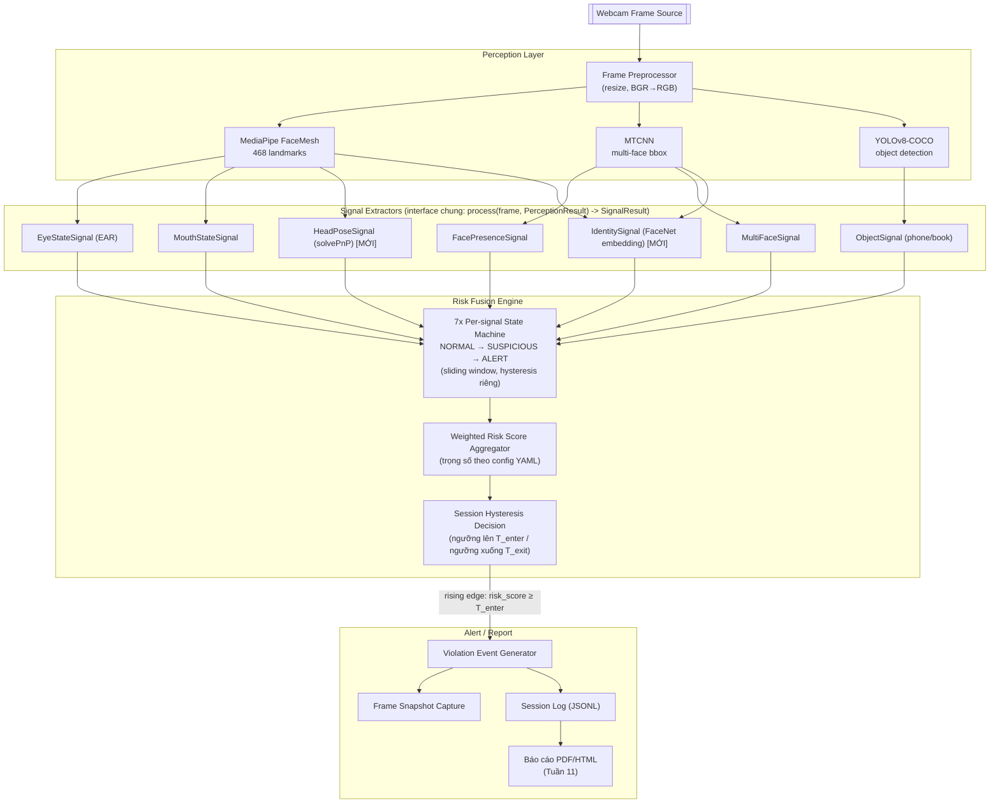
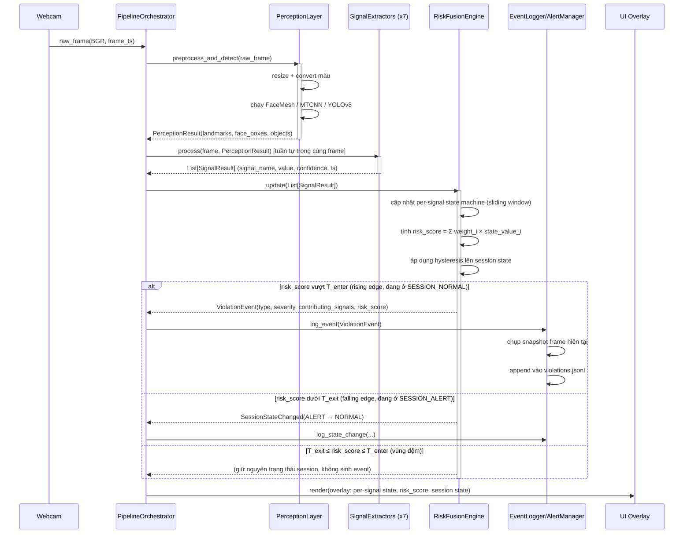
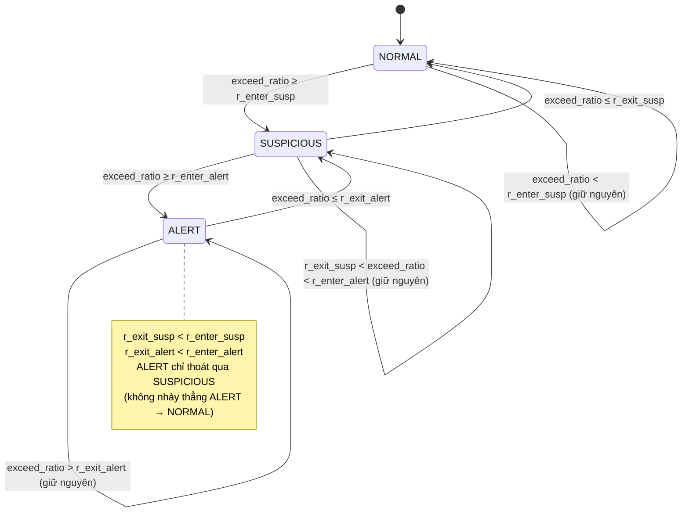
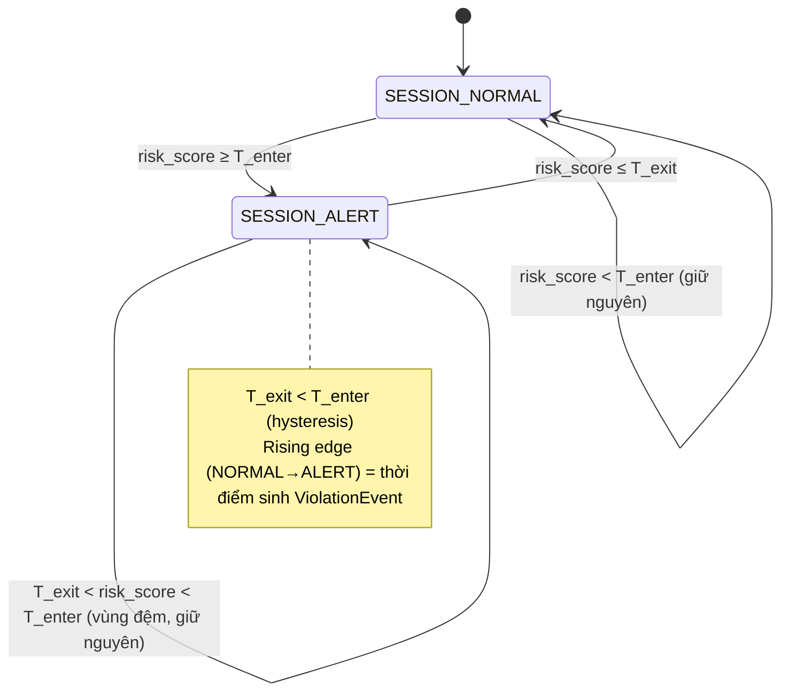
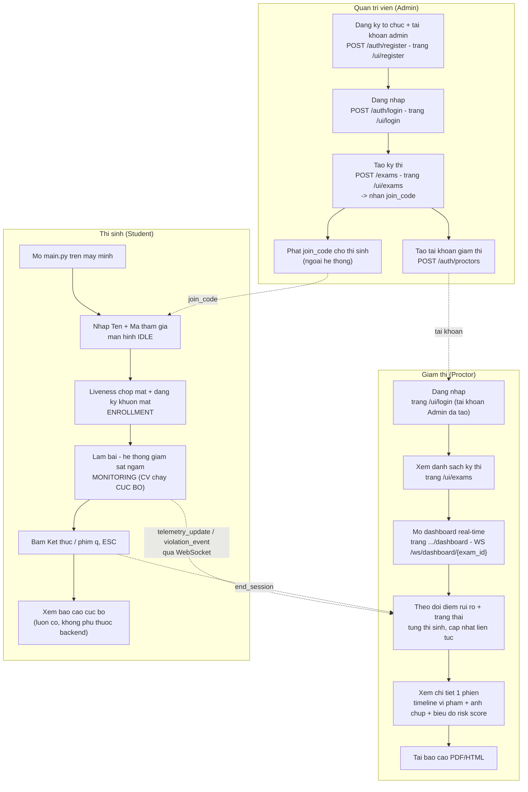
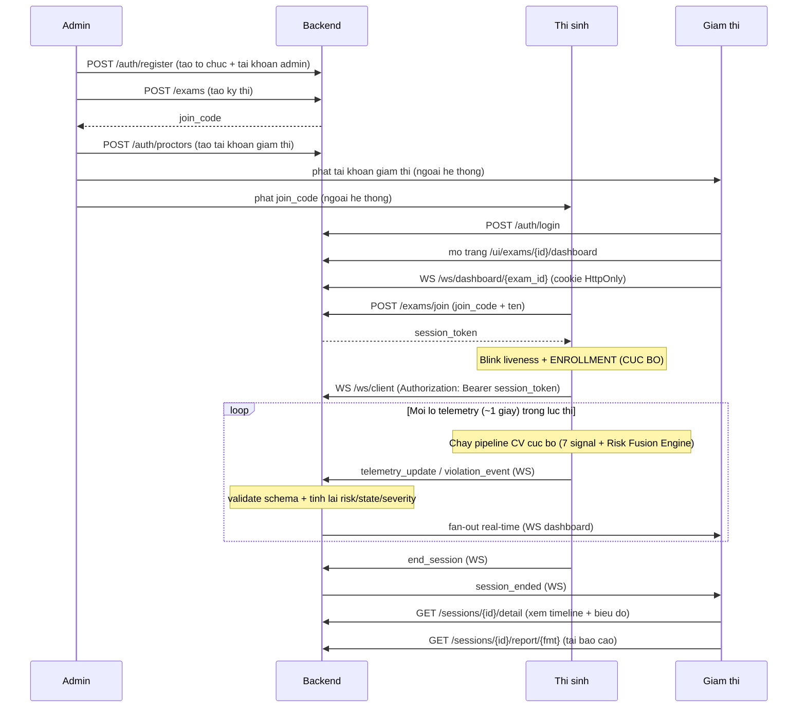
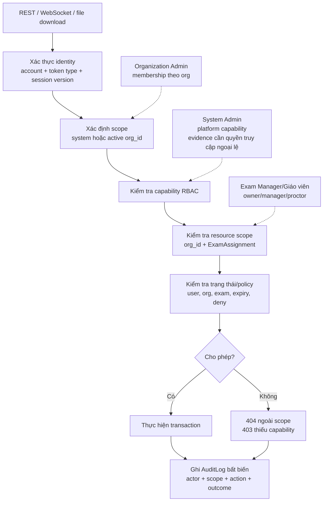
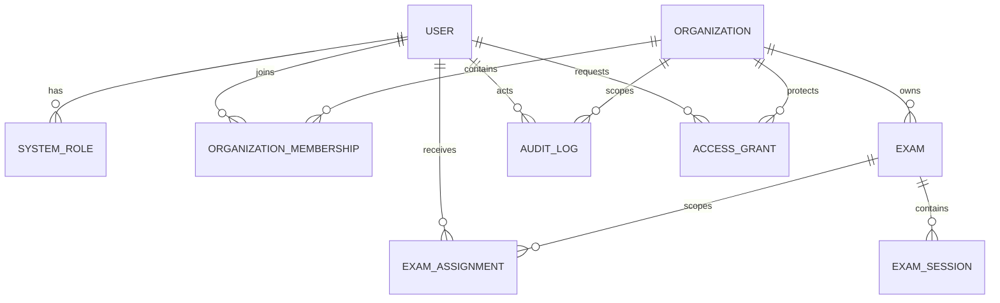

# Sơ đồ thiết kế hệ thống

> Tuần 2. Thiết kế trước khi code, dựa trên kiến trúc 3 tầng tại `KE_HOACH_DO_AN.md` (mục 3.1) và đề cương `docs/DE_CUONG_CHI_TIET.md`. Toàn bộ sơ đồ dùng cú pháp Mermaid — GitHub/VS Code render trực tiếp; không cần công cụ ngoài.

---

## 1. Sơ đồ kiến trúc pipeline

Bốn tầng: **Perception Layer** (trích xuất landmark/bbox thô từ frame) → **Signal Extractors** (7 tín hiệu, mỗi tín hiệu 1 class độc lập theo interface chung) → **Risk Fusion Engine** (state machine + tổng hợp trọng số + hysteresis) → **Alert/Report** (sinh event, log, chụp ảnh, báo cáo).



**Ghi chú thiết kế:**

- `IdentitySignal` (S7) dùng cả bbox từ MTCNN (crop khuôn mặt lớn nhất) lẫn không cần FaceMesh bắt buộc — mô hình embedding (InceptionResnetV1) nằm bên trong chính signal extractor này, không phải tầng Perception dùng chung, vì đây là model chuyên biệt chỉ một signal cần.
- Tầng Perception chỉ chạy các model nền tảng (dò landmark/bbox/object) **một lần mỗi frame**, kết quả (`PerceptionResult`) được chia sẻ cho nhiều signal extractor — tránh chạy trùng MediaPipe/MTCNN nhiều lần trong 1 frame (tối ưu FPS, liên quan mục đo hiệu năng ở Tuần 7).
- Mỗi signal extractor độc lập, có state machine riêng trong Risk Fusion Engine — khác cách bản tham khảo chỉ ghi 1 loại vi phạm/frame.

---

## 2. Sequence diagram — luồng xử lý 1 frame

Mô tả một chu kỳ xử lý: từ khi webcam trả về 1 frame đến khi (có thể) sinh ra violation event.



**Ghi chú thiết kế:**

- Vùng đệm (`T_exit ≤ risk_score ≤ T_enter`) không sinh event, không đổi trạng thái session — đây chính là cơ chế hysteresis chống dao động (chi tiết mục 3).
- `ViolationEvent` chỉ được tạo tại **rising edge** (thời điểm chuyển từ NORMAL sang ALERT), không tạo lặp lại mỗi frame trong lúc đang ALERT — tránh log bị ngập bởi cùng một vi phạm kéo dài. Trạng thái ALERT kéo dài bao lâu được suy ra từ log state-change (mục 3, docs/DATA_SCHEMAS.md).

---

## 3. State diagram — Risk Fusion Engine

### 3.1. Per-signal state machine (áp dụng cho từng tín hiệu trong 7 signal, độc lập với nhau)

Mỗi signal extractor có `exceed_ratio` = tỉ lệ frame vượt ngưỡng thô (raw threshold, đặc thù từng signal — VD EAR < 0.2, yaw > 25°) trong cửa sổ thời gian trượt W (mặc định 3–5 giây). Bản thân state machine từng tín hiệu **cũng dùng hysteresis riêng** (ngưỡng vào cao hơn ngưỡng ra) để tránh việc một tín hiệu đơn lẻ tự dao động ngay trong nội bộ nó trước khi tới tầng tổng hợp.



**Giá trị khởi tạo tham khảo** (sẽ tinh chỉnh thực nghiệm ở Tuần 5-6 khi cài từng signal, và Tuần 14 khi có số liệu):

| Tham số          | Ý nghĩa                                          | Giá trị khởi tạo |
| ----------------- | -------------------------------------------------- | -------------------- |
| `W` (window)    | Độ dài cửa sổ thời gian trượt              | 4 giây              |
| `r_enter_susp`  | Tỉ lệ frame vượt ngưỡng để vào SUSPICIOUS | 0.3                  |
| `r_exit_susp`   | Tỉ lệ để thoát về NORMAL                     | 0.15                 |
| `r_enter_alert` | Tỉ lệ để vào ALERT                            | 0.6                  |
| `r_exit_alert`  | Tỉ lệ để thoát về SUSPICIOUS                 | 0.4                  |

Riêng `IdentitySignal` không chạy mỗi frame mà theo chu kỳ (VD mỗi 30 giây/N frame) — giữa 2 lần re-verification, state được **giữ nguyên (carry-forward)** từ lần đánh giá gần nhất thay vì tính theo cửa sổ trượt như 6 signal còn lại; đây là ngoại lệ cần ghi chú khi cài đặt (Tuần 6).

### 3.2. Tầng tổng hợp (session-level) với hysteresis 2 ngưỡng

Sau khi có state (NORMAL=0, SUSPICIOUS=1, ALERT=2) của cả 7 signal, tính:

```
risk_score = Σ_i ( weight_i × state_value_i )        với i = 1..7, weight_i đọc từ config YAML
```

Trạng thái phiên thi (`SessionRiskState`) chỉ có 2 giá trị, chuyển đổi theo `risk_score` bằng 2 ngưỡng khác nhau (Schmitt trigger / hysteresis kinh điển):



`T_enter` và `T_exit` cũng là tham số cấu hình qua YAML (mục 4, `docs/DATA_SCHEMAS.md`), khởi tạo thủ công theo mức độ nghiêm trọng chủ quan, tinh chỉnh bằng thực nghiệm Tuần 14 (so sánh có/không hysteresis, đo tỉ lệ báo động giả — theo kế hoạch mục 3.3 của `KE_HOACH_DO_AN.md`).

---

## 4. Sơ đồ luồng người dùng & quản trị viên (Tuần 12-15, lớp platform)

> Khác 3 mục trên (kiến trúc xử lý CV nội bộ 1 phiên) — mục này mô tả cách **3 vai trò con người** tương tác với hệ thống qua lớp platform (backend + dashboard, xem `docs/KE_HOACH_PLATFORM.md`). Không có video/hình ảnh trực tiếp truyền giữa các vai trò (quyết định đã chốt — xem mục 1 `docs/KE_HOACH_PLATFORM.md`), chỉ có số liệu (risk score, loại vi phạm) và ảnh chụp bằng chứng.
>
> **Lưu ý:** mục 4 phản ánh role `admin/proctor` đang có. Sơ đồ kiến trúc mục
> tiêu System Admin/Organization Admin/Exam Manager nằm ở mục 6.

### 4.1. Vai trò

| Vai trò                           | Có tài khoản?                                       | Giao diện dùng                                                     | Quyền chính                                                                                                           |
| ---------------------------------- | ------------------------------------------------------ | -------------------------------------------------------------------- | ----------------------------------------------------------------------------------------------------------------------- |
| **Quản trị viên (Admin)** | Có (email/mật khẩu)                                 | Web (`/ui/exams`, `/ui/register`)                                | Tạo tổ chức, tạo kỳ thi (sinh`join_code`), tạo tài khoản giám thị                                           |
| **Giám thị (Proctor)**     | Có (do Admin tạo)                                    | Web (`/ui/exams/{id}/dashboard`, `/ui/exams/{id}/sessions/{id}`) | Xem dashboard real-time, xem chi tiết phiên, tải báo cáo —**không tạo được kỳ thi/tài khoản khác** |
| **Thí sinh (Student)**      | Không có tài khoản, chỉ nhập tên +`join_code` | App desktop cục bộ (`main.py`, cửa sổ OpenCV)                  | Tham gia 1 kỳ thi, được giám sát — không truy cập được dashboard/dữ liệu thí sinh khác                  |

### 4.2. Sơ đồ luồng theo từng vai trò



### 4.3. Sequence diagram — 1 kỳ thi đầy đủ, cả 3 vai trò



**Ghi chú thiết kế:**

- Backend **không chạy model CV**, nhưng không chuyển tiếp mù quáng: nó kiểm tra
  schema, đủ bảy signal, tính lại risk/hysteresis, đối chiếu violation và dùng
  timestamp server trước khi ghi/fan-out.
- Thí sinh **không có tài khoản** — `session_token` (không phải JWT admin/proctor) là "vé" duy nhất, chỉ mở khóa đúng 1 phiên của chính nó (xem `backend/tests/test_auth_token_confusion.py`).
- Nếu backend không kết nối được (Admin/Proctor chưa `docker compose up`, hoặc thí sinh mất mạng), nhánh Thí sinh vẫn chạy hết tới `S6` bình thường — thiết kế offline-first (xem `docs/KE_HOACH_PLATFORM.md` mục 3b).

---

## 5. Tổng hợp liên kết tài liệu

- Kiến trúc pipeline gốc: `KE_HOACH_DO_AN.md`, mục 3.1.
- Đề cương & khảo sát kỹ thuật (cơ sở lý thuyết cho hysteresis, state machine): `docs/DE_CUONG_CHI_TIET.md`, mục 5.3.
- Cấu trúc dữ liệu tương ứng các sơ đồ trên (JSON schema, log format, ground-truth format): `docs/DATA_SCHEMAS.md` (mục 1-6 cho CV, mục 7 cho data model platform).
- Kiến trúc + quyết định thiết kế lớp platform (multi-tenant, backend, dashboard): `docs/KE_HOACH_PLATFORM.md`.

---

## 6. Sơ đồ phân quyền quản trị mục tiêu



Quan hệ phạm vi dữ liệu:



System Admin không có đường truy cập mặc định tới `ExamSession`/evidence. Muốn
hỗ trợ dữ liệu nhạy cảm phải có `AccessGrant` còn hạn; Organization Admin đi
qua membership cùng `org_id`; Exam Manager phải có thêm `ExamAssignment` của
đúng kỳ thi. Chi tiết ma trận quyền và sitemap xem
`docs/QUAN_TRI_VA_PHAN_QUYEN.md`.
